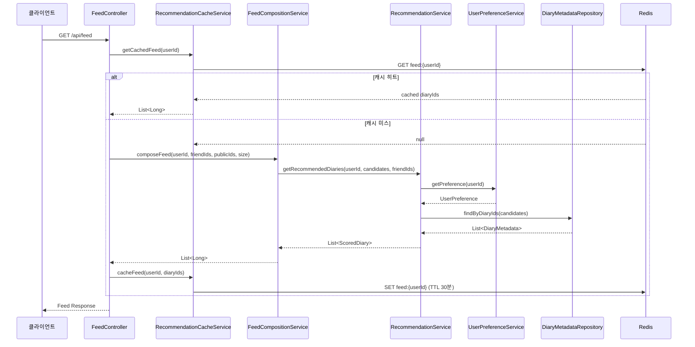
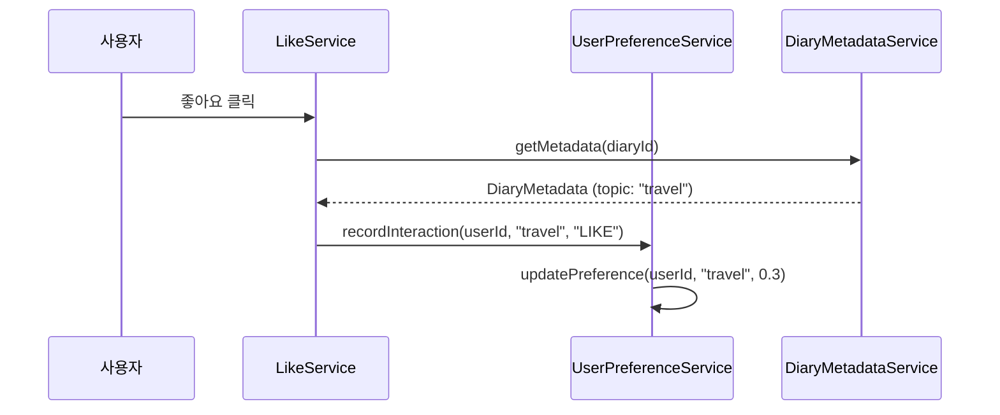

# 추천 시스템 흐름 문서

## 개요

사용자가 피드를 요청했을 때, 추천 시스템이 어떻게 동작하는지 단계별로 설명합니다.

---

## 전체 흐름도



---

## 단계별 상세 설명

### 1단계: 피드 요청 수신

**담당**: `FeedController` / `FeedService`

```java
// 클라이언트가 피드를 요청
GET /api/feed?page=0&size=10
Authorization: Bearer {token}
```

사용자 ID는 JWT 토큰에서 추출됩니다.

---

### 2단계: 캐시 확인

**담당**: `RecommendationCacheService`

```java
public List<Long> getCachedFeed(String userId) {
    String key = "feed:" + userId;
    Object cached = redisTemplate.opsForValue().get(key);
    
    if (cached == null) {
        return Collections.emptyList();  // 캐시 미스
    }
    
    return (List<Long>) cached;  // 캐시 히트
}
```

**Redis 키 형식**: `feed:{userId}`  
**TTL**: 30분

#### 캐시 히트 시
- Redis에서 일기 ID 목록을 바로 반환
- 추천 계산 과정 생략 → 응답 속도 향상

#### 캐시 미스 시
- 3단계로 진행하여 추천 계산 수행

---

### 3단계: 피드 후보 수집

**담당**: `FeedService` → `FeedCompositionService`

피드에 포함될 후보 일기들을 수집합니다.

```java
// 친구 일기 수집
List<Long> friendDiaryIds = getFriendDiaries(userId);

// 공개 일기 수집  
List<Long> publicDiaryIds = getPublicDiaries();

// 이미 조회한 일기 제외
List<Long> candidates = excludeReadDiaries(userId, allDiaries);
```

**후보 우선순위**:
1. 친구의 새 일기 (읽지 않은)
2. 친구의 이전 일기 (최근 클릭 기준)
3. 공개 일기

---

### 4단계: 사용자 선호도 조회

**담당**: `UserPreferenceService`

```java
public Optional<UserPreference> getPreference(String userId) {
    return userPreferenceRepository.findByUserId(userId);
}
```

**UserPreference 구조**:
```json
{
  "userId": "user-123",
  "topicAffinities": {
    "travel": 0.8,
    "food": 0.5,
    "fitness": 0.3
  }
}
```

토픽별 선호도는 사용자의 행동에 따라 누적됩니다:
| 행동 | 가중치 |
|------|--------|
| 좋아요 | +0.3 |
| 클릭 | +0.15 |
| 조회 | +0.1 |

---

### 5단계: 일기 메타데이터 조회

**담당**: `DiaryMetadataRepository`

```java
List<DiaryMetadata> findByDiaryIds(List<Long> diaryIds);
```

**DiaryMetadata 구조**:
```json
{
  "diaryId": 1,
  "primaryTopic": "travel",
  "topics": "{\"travel\":0.9,\"food\":0.3}",
  "qualityScore": 0.8
}
```

일기 작성 시 `LocalContentAnalyzer`가 자동으로 분석:
- 키워드 기반 토픽 분류 (travel, food, fitness 등)
- 콘텐츠 품질 점수 (길이, 상세도 기반)

---

### 6단계: 스코어 계산

**담당**: `RecommendationService`

각 일기에 대해 추천 점수를 계산합니다.

```java
public double calculateScore(DiaryMetadata metadata, 
                             Map<String, Double> userAffinities, 
                             boolean isFriend) {
    // 토픽 매칭 점수 (40%)
    double topicScore = userAffinities.getOrDefault(metadata.getPrimaryTopic(), 0.1);
    
    // 품질 점수 (30%)
    double qualityScore = metadata.getQualityScore();
    
    // 최신성 점수 (20%)
    double recencyScore = 0.5;
    
    // 기본 점수 계산
    double baseScore = (0.4 * topicScore) + (0.3 * qualityScore) + (0.2 * recencyScore);
    
    // 친구 보너스 (15%)
    if (isFriend) {
        baseScore += 0.15;
    }
    
    return Math.min(1.0, baseScore);
}
```

**스코어 공식**:
```
Score = (0.4 × TopicMatch) + (0.3 × Quality) + (0.2 × Recency) + (0.15 × FriendBonus)
```

---

### 7단계: 피드 구성

**담당**: `FeedCompositionService`

점수순으로 정렬된 일기들을 고정/변동 슬롯에 배치합니다.

```java
public List<Long> composeFeed(String userId, 
                               List<Long> friendDiaryIds, 
                               List<Long> publicDiaryIds, 
                               int requestedSize) {
    // 1. 모든 후보에 대해 스코어 계산
    List<ScoredDiary> scoredDiaries = recommendationService
        .getRecommendedDiaries(userId, allCandidates, friendDiaryIds);
    
    // 2. 고정 슬롯: 친구 일기 우선 배치
    List<ScoredDiary> friendScored = filterFriendDiaries(scoredDiaries);
    
    // 3. 변동 슬롯: 나머지 점수순 배치
    List<ScoredDiary> remainingScored = filterRemaining(scoredDiaries);
    
    // 4. 최종 피드 조합
    return combineResults(friendScored, remainingScored, requestedSize);
}
```

**피드 구성 규칙**:
```
[고정 슬롯] [변동 슬롯] [변동 슬롯] [변동 슬롯] ...
  친구①      추천①       추천②       추천③
```

---

### 8단계: 캐시 저장

**담당**: `RecommendationCacheService`

```java
public void cacheFeed(String userId, List<Long> diaryIds) {
    String key = "feed:" + userId;
    redisTemplate.opsForValue().set(key, diaryIds, 30, TimeUnit.MINUTES);
}
```

**캐시 정책**:
| 항목 | 값 |
|------|-----|
| 키 형식 | `feed:{userId}` |
| TTL | 30분 |
| 저장 데이터 | `List<Long>` (일기 ID 목록) |

---

### 9단계: 응답 반환

최종적으로 일기 ID 목록을 기반으로 상세 정보를 조회하여 클라이언트에 반환합니다.

```json
{
  "content": [
    {
      "diaryId": 1,
      "content": "오늘 여행을 다녀왔다...",
      "imgUrls": ["..."],
      "nickname": "친구1",
      "likeCount": 10,
      "isLiked": false
    }
  ],
  "totalPages": 5,
  "totalElements": 50
}
```

---

## 캐시 무효화 시점

다음 상황에서 캐시가 무효화됩니다:

```java
public void invalidateCache(String userId) {
    String key = "feed:" + userId;
    redisTemplate.delete(key);
}
```

| 이벤트 | 무효화 대상 |
|--------|-------------|
| 새 일기 작성 | 작성자의 모든 친구 캐시 |
| 좋아요 | 해당 사용자 캐시 |
| 친구 추가/삭제 | 양측 사용자 캐시 |
| TTL 만료 | 자동 삭제 (30분) |

---

## 선호도 업데이트 흐름

사용자가 일기와 상호작용할 때 선호도가 업데이트됩니다.



---

## 성능 고려사항

### Redis 캐시
- **캐시 히트율 목표**: 80% 이상
- **TTL 설정 근거**: 30분은 일반적인 세션 시간 고려
- **메모리 사용량**: 유저당 약 1KB (100개 ID 기준)

### 스코어링 최적화
- 메타데이터 배치 조회로 N+1 문제 방지
- 선호도 Map 형태로 O(1) 조회

### 확장성
- Redis Cluster 지원 가능
- 캐시 키에 버전 접미사 추가 가능 (`feed:v2:{userId}`)
