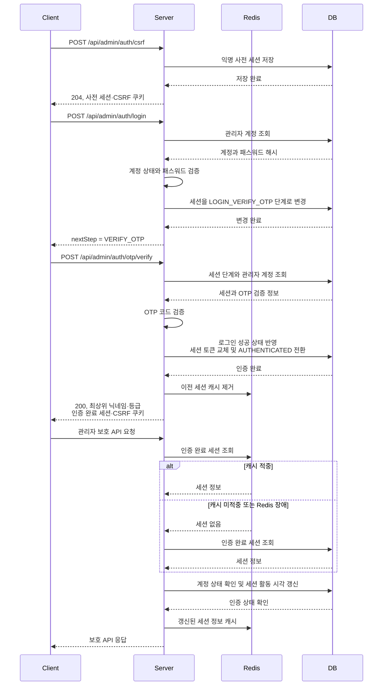
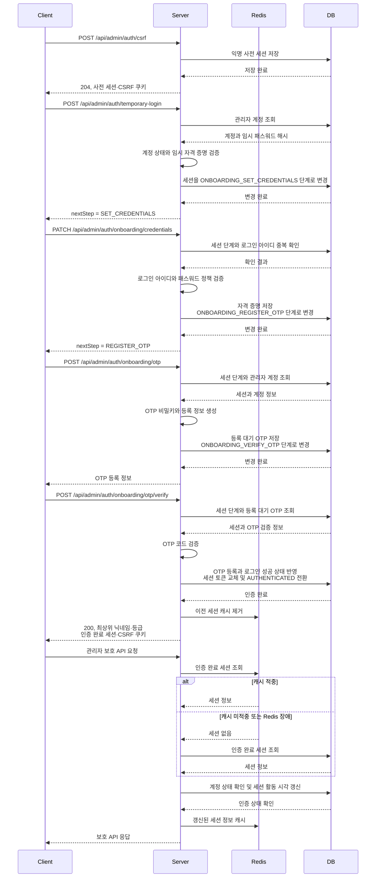

# 관리자 세션 인증 흐름

- Status: Active
- Audience: Backend Engineers
- Source of Truth: Yes
- Last Reviewed: 2026-07-23

## 목적

관리자 도메인이 사전 세션, 자격 증명, OTP, 인증 완료 세션을 사용해 정식 로그인과 최초 온보딩을 처리하는 내부 흐름을 정의한다.

프론트엔드 연동 계약은 `docs/handoffs/admin-session-authentication-handoff.md`를 기준으로 한다. 이 문서는 백엔드 계층의 책임과 세션 단계 전환만 다룬다.

## 책임 경계

- Web Adapter는 쿠키와 요청 값을 읽고 인증 유스케이스를 호출하며, 완료된 세션 자격 증명을 쿠키로 전달한다.
- 인증 및 온보딩 유스케이스는 계정 상태, 자격 증명, OTP 정책을 검증하고 다음 세션 단계를 결정한다.
- `AdminSessionSecurityUseCase`는 익명 사전 세션 생성과 인증 완료 세션 검증을 담당하며 Security에는 전용 공개 Result만 반환한다.
- `ManageAdminSessionLifecycleUseCase`는 사전 세션 결합, 단계 검증, 단계 전환, 인증 완료를 위한 Admin 내부 Application 협력 경계다.
- `AdminSession`은 현재 인증 단계와 세션 활성 상태를 보호한다.
- 계정, 패스워드, OTP, 세션 저장 기술은 각각의 Out Port와 Adapter 뒤에 위치한다.
- 보안 필터는 Origin과 CSRF를 검증하며, 인증 완료 이후에는 Admin 공개 Result를 Spring Security 인증 주체로 변환한다.
- Security는 Admin Telemetry Out Port를 직접 호출하지 않는다. CSRF·Origin 거부와 저장소 장애 사건은 `RecordAdminSecurityEventUseCase`로 전달한다.

## Security Filter Chain

관리자 경로에는 일반 사용자 Bearer Token Chain보다 먼저 평가되는 `Order(1)` 전용 Chain을 사용한다.

1. CORS 처리 전에 관리자 Origin을 검증한다.
2. Origin 검증 뒤 관리자 CSRF Cookie와 Header 및 서버 세션 값을 검증한다.
3. 유효한 관리자 세션 Cookie를 Admin 공개 `AuthenticatedAdminSessionResult`로 조회하고 `AdminPrincipal`로 변환한다.
4. 인증 Filter 뒤에 `AdminSecurityChainExtension`을 배치해 Admin 소유 추가 Filter를 조합한다.

Origin, CSRF와 세션 Filter는 Admin Domain·Out Port·Service를 직접 참조하지 않는다. 모든 Filter 실패 응답은 Security 소유 `SecurityProblemResponseWriter`가 공통 `ProblemDetailFactory`로 직렬화하며 `application/problem+json`, UTF-8과 `Cache-Control: no-store`를 적용한다.

## 정식 로그인 흐름

정식 로그인은 익명 사전 세션에서 시작해 `LOGIN_VERIFY_OTP`를 거쳐 `AUTHENTICATED`로 전환된다.

## 최초 온보딩 흐름

최초 온보딩은 임시 자격 증명 검증 후 `ONBOARDING_SET_CREDENTIALS`, `ONBOARDING_REGISTER_OTP`, `ONBOARDING_VERIFY_OTP`, `AUTHENTICATED` 순서로 진행된다.

## 세션 전환 규칙

- 사전 세션은 `ANONYMOUS`에서만 계정과 결합할 수 있다.
- 정식 로그인과 최초 온보딩은 서로 다른 세션 단계를 사용하며 중간 단계를 건너뛸 수 없다.
- 각 단계 변경 시 현재 계정의 인증 버전을 세션과 함께 검증한다.
- OTP 검증 단계에서만 인증 완료 세션으로 전환할 수 있다.
- 인증 완료 시 세션 토큰과 CSRF 토큰을 모두 새 값으로 교체한다.
- 다른 인증 완료 세션이 존재하면 폐기해 관리자 계정당 하나의 활성 세션만 유지한다.
- 계정 비활성화나 인증 버전 불일치는 인증 완료 세션을 무효화한다.

## 오류 경계

- Web Adapter와 보안 필터는 인증 실패를 RFC 9457 Problem Details 응답으로 변환한다.
- Admin Application은 `AdminErrorCode`만 반환하고 HTTP type, status와 title은 Admin Web 또는 Security Adapter가 결정한다.
- 기존 관리자 Problem type URI, status, detail과 `Cache-Control: no-store` 계약은 Adapter 번역 이후에도 유지한다.
- 인증 Entry Point와 권한 거부 Handler는 Spring 내부 예외 메시지를 외부 detail로 전달하지 않고 중립적인 문구를 사용한다.
- 유스케이스는 저장 기술 예외를 관리자 인증 저장소 오류로 변환한다.
- 세션 단계 불일치, 만료, 폐기, 계정 불일치는 인증되지 않은 요청으로 처리한다.
- OTP 실패와 계정 잠금은 도메인 정책에 따라 실패 횟수와 차단 상태를 갱신한다.
