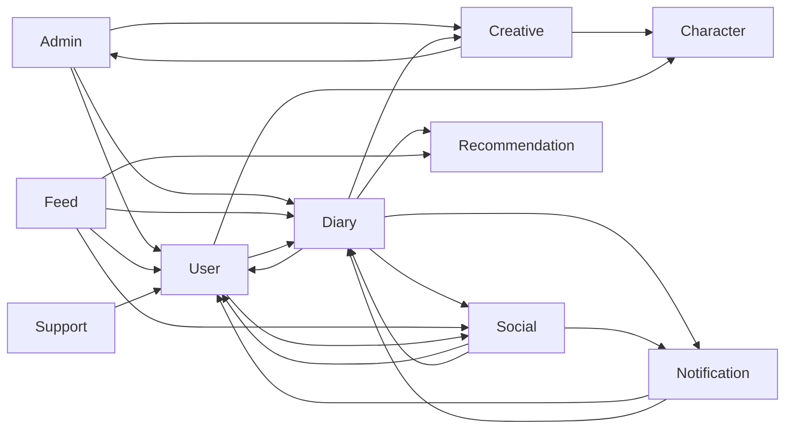

# Bounded Context Map

- Status: Active
- Audience: Engineers
- Source of Truth: Yes
- Last Reviewed: 2026-07-10

## 목적

이 문서는 `piku-back`에 현재 존재하는 비즈니스 모듈의 책임과 주요 호출 관계를 정리한다. Context 경계를 이해하고 Cross-Context 의존 방향을 판단하기 위한 문서이며, 새로운 Aggregate·테이블·API 또는 패키지 구조를 도입하는 설계 문서가 아니다.

계층과 Port·Adapter 규칙은 [DDD + 헥사고날 아키텍처](ddd-hexagonal-architecture.md), 구현된 도메인 모델의 상세 규칙은 [Domain Models](../domain-models/README.md)를 따른다.

## 1. 비즈니스 Context와 모듈

| Context 또는 모듈 | 현재 책임 | 상세 문서 |
| --- | --- | --- |
| **Admin** | 관리자 계정, 관리자 인증·세션, 감사와 운영 통계 | [Admin](../domain-models/admin.md) |
| **Character** | 고정·사용자 캐릭터와 캐릭터 이미지 자산 | - |
| **Creative** | AI 일기 이미지 생성과 생성 이력 | [Creative](../domain-models/creative.md) |
| **Diary** | 일기, 사진, 공개 범위와 일기 생명주기 | [Diary](../domain-models/diary.md) |
| **Feed** | 피드 후보·목록 구성, 정렬과 열람 행위 기록 | [Feed](../domain-models/feed.md) |
| **Notification** | 알림 이력, 읽음·삭제, SSE·FCM 전달과 기기 토큰 | [Notification](../domain-models/notification.md) |
| **Recommendation** | 일기 메타데이터, 사용자 선호와 추천 정보 | - |
| **Social** | 친구 요청·관계, 댓글, 답글과 좋아요 | [Social](../domain-models/social.md) |
| **Support** | 사용자 문의, 문의 이미지와 피드백 전달 | - |
| **User** | 사용자 식별 정보, 프로필, 닉네임 점유와 회원 탈퇴 | [User](../domain-models/user.md) |

`user.auth`는 현재 `user` 아래에서 회원가입, 이메일 인증과 비밀번호 재설정을 처리하는 하위 모듈이다. `security`는 아래와 같이 로그인·토큰 유스케이스와 보안 기술 책임이 함께 있는 현재 구조로 기록한다. 둘의 책임을 재편하거나 User 모델을 분리하는 결정은 이 Context Map의 범위가 아니다.

## 2. 지원·기술 모듈

| 모듈 | 현재 책임 |
| --- | --- |
| **security** | 일반 사용자 로그인, 토큰 발급·재발급·로그아웃과 Spring Security, JWT 등 보안 구현 |
| **global** | 공통 오류 처리, 설정, 유틸리티와 도메인 중립 기반 기능 |
| **tools** | 운영·개발용 생성기와 변환 도구 |

지원·기술 모듈도 Application과 Adapter를 함께 포함할 수 있다. 실제 책임과 이상적인 책임이 혼재한 위치는 Context 이름을 바꾸거나 새 모델을 추가하지 않고 갭 분석에서 의존성 문제로 추적한다.

## 3. 주요 관계

화살표는 호출하는 모듈이 대상 모듈의 정보나 동작을 사용한다는 뜻이다. 데이터베이스 테이블 소유권이나 트랜잭션 분리를 뜻하지 않으며, 반대 방향의 호출이 존재하더라도 한 요청 안에서 순환 호출을 만들어서는 안 된다.

## 4. 주요 통합 목적

| 호출 Context | 대상 Context | 현재 호출 목적 |
| --- | --- | --- |
| Admin | User, Diary, Creative | 회원·일기·AI 이미지 운영 통계 조회 |
| Creative | Character | AI 이미지 생성에 필요한 캐릭터 자산 조회 |
| Creative | Admin | AI 이미지 요청·실패 통계 기록 |
| Diary | User | 작성자 존재 확인 |
| Diary | Social | 친구 관계와 친구 공개 알림 대상 조회 |
| Diary | Creative | 생성 이미지 조회와 일기 연결 |
| Diary | Notification | 친구 공개 일기 알림 요청 |
| Diary | Recommendation | 일기 본문 메타데이터 분석 요청 |
| Feed | User | 작성자 닉네임·아바타 조회 |
| Feed | Diary | 피드 후보와 상세 일기 조회 |
| Feed | Social | 친구 관계, 좋아요와 댓글 정보 조회 |
| Feed | Recommendation | 추천 정보 조회와 열람 선호 기록 |
| Notification | User, Diary | 알림 응답에 필요한 발신자와 일기 정보 조회 |
| Social | User | 친구·댓글 응답에 필요한 사용자 정보 조회 |
| Social | Diary | 댓글·좋아요 대상 일기 확인 |
| Social | Notification | 친구·댓글·좋아요 알림 요청 |
| Support | User | 문의 제출 사용자 확인 |
| User | Character | 프로필 아바타로 사용할 캐릭터 조회 |
| User | Diary, Social | 프로필 응답에 필요한 일기·친구 정보 조회 |

이 표는 현재 구현의 업무 관계를 요약한다. 호출 방식이 아키텍처 규칙을 위반하는지는 [미비점 분석](ddd-hexagonal-architecture-gap-analysis.md)에서 별도로 판정한다.

## 5. 경계 해석 원칙

- 호출 Context는 필요한 능력을 자신의 Out Port로 표현하고 Cross-Context Adapter에서 대상 In Port를 호출한다.
- 대상 Context의 Entity, Out Port, Repository와 Persistence Adapter는 다른 Context에 공개하지 않는다.
- `User`, `user.auth`, `security`처럼 현재 책임이 인접한 모듈은 실제 동작을 우선 기록하고, 문서만으로 새 경계나 모델을 확정하지 않는다.
- 이 문서의 수정만으로 기존 기능, 데이터 소유권과 트랜잭션 동작이 변경되지는 않는다.
- 새로운 경계나 모델 분리가 필요하면 영향 범위와 마이그레이션을 포함한 별도 설계에서 결정한다.
