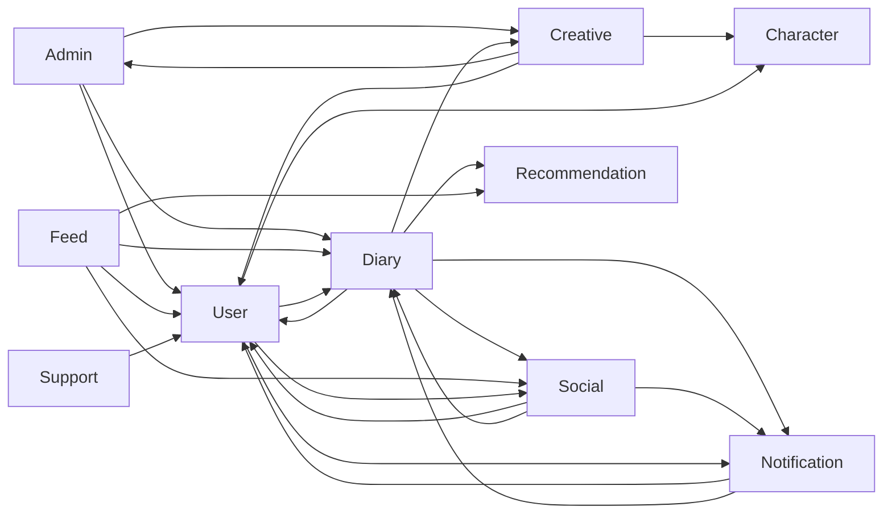

# Bounded Context Map

- Status: Active
- Audience: Engineers
- Source of Truth: Yes
- Last Reviewed: 2026-08-11

## 목적

이 문서는 `piku-back`에서 현재 식별한 모델 경계, 경계의 확신도, Context 간 접점과 번역 상태를 기록한다.

Context Map은 Java 패키지 목록이나 런타임 호출 그래프와 같지 않다. 패키지와 호출은 모델 경계를 찾는 근거 중 하나이며, Bounded Context는 특정 모델과 Ubiquitous Language가 정의되고 적용되는 경계다.

이 문서는 현재 합의된 모델 지형을 기록한다. 구현이 합의된 경계를 따르지 않는 상태는 모델 정의와 구분하며, Context 분할·병합과 데이터 마이그레이션은 별도 설계에서 결정한다.

## 1. Domain Vision과 Core Domain

Piku는 사용자가 하루의 감정과 상황을 일기 내용과 생성 이미지로 기록하고, 시간이 지나 쌓인 기록을 달력·일기 수·사진 모아보기로 다시 발견하면서 자신의 변화와 성취를 느끼도록 돕는다.

현재 Core Domain은 **감정 일기 기록과 시각적 회고**다. Diary Context가 일기 내용, 날짜, 생성 이미지와 사용자 사진의 연결, 공개 범위, 기록 생명주기, 달력과 기록 조회 정책을 소유한다.

현재 모델은 감정을 별도 값이나 통계로 저장하지 않는다. 감정은 사용자가 작성한 일기 내용과 AI 생성 이미지로 표현된다. 감정 입력과 통계는 향후 제품 결정이 있기 전까지 현재 모델과 규칙에 포함하지 않는다.

Creative는 AI 이미지 생성이 현재 일기 작성의 필수 선행 능력이더라도 Supporting Subdomain으로 분류한다. Creative는 이미지 생성 과정과 이력을 소유하고, 기록과 회고의 의미 및 정책은 Diary가 소유한다.

## 2. 경계 상태

| 상태 | 의미 | 사용 방법 |
| --- | --- | --- |
| **Working Context** | 현재 모델·책임 문서와 코드 소유권을 근거로 리팩터링 기준 경계로 사용한다. | 경계를 넘을 때 내부 모델과 저장소를 직접 사용하지 않는다. |
| **Boundary Candidate** | 독립된 책임과 코드 구조는 있으나 고유 언어·불변식·소유권 검증이 충분하지 않다. | 별도 Context라고 단정하지 않고 모델 탐구 결과에 따라 유지·병합한다. |
| **Unresolved Boundary** | 인접 영역 사이의 모델과 책임이 현재 겹치거나 기술 책임과 비즈니스 책임이 섞여 있다. | 구조를 먼저 확정하지 않고 유스케이스와 용어 소유권을 검증한다. |
| **Technical Module** | 비즈니스 모델 경계가 아니라 여러 영역을 지원하는 기술 모듈이다. | 비즈니스 규칙과 특정 Context 모델을 소유하지 않게 한다. |

`Working Context`는 영구 확정 선언이 아니다. 현재 리팩터링에서 모델 누출을 방지하기 위한 운영상 기준이며 도메인 통찰이 바뀌면 함께 변경한다.

## 3. 현재 모델 경계

| 영역 | 경계 상태 | 전략 분류 | 현재 모델과 책임 | 확인할 경계 질문 |
| --- | --- | --- | --- | --- |
| **Admin** | Working Context | 미분류 | 관리자 계정, 자격 증명, OTP, 세션, 감사와 운영 통계 및 공개 보안 계약 | 운영 통계가 독립된 언어와 생명주기를 가져 별도 분석 영역으로 분리되어야 하는가? |
| **Character** | Working Context | Supporting | 고정·사용자 캐릭터, 이미지 참조와 고정 자산 카탈로그 | 사용자 아바타 선택과 향후 AI 캐릭터 생성 중 어떤 정책을 Character가 계속 소유할 것인가? |
| **Creative** | Working Context | Supporting | AI 일기 이미지 생성, 생성 상태, 할당량, 생성 자산과 이력 | 생성 자산과 Diary 기록 표현의 소유권이 계속 분리되어 있는가? |
| **Diary** | Working Context | Core | 일기 내용, 날짜, 사진, 생성 이미지 연결, 공개 범위, 기록 생명주기, 달력과 회고 조회 | 공개·피드·소셜 정책 중 어떤 규칙을 Diary가 소유해야 하는가? |
| **Feed** | Working Context | 미분류 | 피드 후보·목록 구성, 정렬과 열람 행위 | Feed가 독립된 도메인 모델인가, Application Read Model 영역인가? |
| **Notification** | Working Context | 미분류 | 알림 이력, 읽음·삭제, 전달 요청과 기기 토큰 | 알림 기록·표현 정책과 best-effort 전달 보장을 어느 수준까지 같은 모델에서 다룰 것인가? |
| **Recommendation** | Working Context | Supporting | 일기 분석 메타데이터, 사용자 주제 친화도와 후보 점수 | 향후 추천 정책이 제품 차별화의 핵심으로 성장하면 전략 분류를 다시 평가해야 하는가? |
| **Social** | Working Context | 미분류 | 친구 요청·관계, 댓글, 답글과 좋아요 | 친구 관계와 일기 반응이 하나의 언어와 모델에 속하는가? |
| **Support** | Working Context | Supporting | 사용자 문의, 선택적 첨부 참조와 운영 알림 | 문의 답변·상태 워크플로가 추가되면 현재 단일 Aggregate 경계를 어떻게 확장할 것인가? |
| **User** | Working Context | 미분류 | 일반 사용자 계정 생명주기, 자격 증명, 이메일 검증, 인증 유스케이스, 선택된 캐릭터 식별자, 프로필과 닉네임 점유 | 계정·인증 Application과 Security Adapter의 기술 책임이 분리되어 있는가? |

`미분류`는 중요도가 낮다는 의미가 아니라 제품 전략과 모델 근거를 대화로 더 확인해야 한다는 뜻이다. 코드 규모, 트래픽과 현재 패키지 구조만으로 전략 분류를 대신하지 않는다.

## 4. 일반 사용자 계정과 인증 경계

일반 사용자 계정과 인증 Application은 User Context가 소유한다.

| 책임 | 소유 경계 |
| --- | --- |
| 계정 등록·탈퇴, 이메일·비밀번호와 로그인 가능 상태 | User Domain |
| 이메일 검증과 비밀번호 재설정 정책 | User Domain |
| 회원가입, 로그인, 세션 재발급과 로그아웃 흐름 | User Application |
| 비밀번호 해시·검증, 토큰 생성·검증, 보안 필터와 쿠키 변환 | Security Adapter |
| 갱신 세션 저장과 조회 기술 | Security·Persistence Adapter |

현재 `user.auth`는 별도 Bounded Context가 아니라 User Context 내부의 계정 등록·자격 증명 관리 기능으로 해석한다. 일반 사용자 로그인·재발급·로그아웃 조정 책임은 User Application이 소유하며, Security에는 비밀번호·JWT·갱신 세션과 Web 인증 표현의 기술 구현만 남는다.

관리자 계정과 인증 정책은 Admin Context가 소유한다. 일반 사용자 인증과 기술 구현을 재사용할 수는 있지만 계정 모델, 세션 정책과 Ubiquitous Language를 공유하지 않는다. Security는 Admin 공개 In Port와 공개 Result를 Spring Security Principal, Cookie와 RFC 9457 응답으로 번역하며 Admin Domain, Out Port와 Web Adapter를 직접 참조하지 않는다.

Security 런타임은 두 Filter Chain으로 구성한다. `Order(1)` 관리자 Chain은 Origin, CSRF, 관리자 세션 인증과 Admin 확장 Filter 순서를 유지하고, `Order(2)` 일반 사용자 Chain은 Bearer Token 인증과 공개·보호 경로 및 Actuator IP 접근을 구성한다. CORS, Cookie, JWT, Principal과 Filter 오류 직렬화는 Security 기술 책임이며 User·Admin의 계정·세션 규칙으로 해석하지 않는다.

## 5. 기술 모듈

| 모듈 | 현재 책임 | 경계 원칙 |
| --- | --- | --- |
| **global** | 공통 오류 처리, 설정, 저장소 기반 기능과 유틸리티 | 특정 Context의 Domain 타입과 비즈니스 규칙을 소유하지 않는다. |
| **tools** | 운영·개발용 생성기와 변환 도구 | 제품 Domain 모델과 분리한다. |
| **security** | 비밀번호 보호, JWT·갱신 세션, Principal, 보안 필터, Cookie와 RFC 9457 Writer | User와 Admin의 공개 Application In Port·DTO를 기술 표현으로 번역하며 Domain 모델, Application 유스케이스와 다른 Context의 내부 계층을 소유하거나 참조하지 않는다. |

`global`을 여러 Context가 사용한다는 이유로 Shared Kernel이라고 부르지 않는다. Shared Kernel은 팀이 의도적으로 공유하고 공동 변경하는 작은 도메인 모델이며, 일반 기술 유틸리티와는 다르다.

Global의 파일·객체 저장 계약은 바이트 로드·저장과 표시 URL 해석만 표현하며 중립 S3 Object Storage Adapter가 이를 구현한다. Object Key, 파일명, 공개 여부, 캐시 정책과 생명주기는 Character, Creative, Diary, Support 등 실제 소비자가 소유하며 Global은 해당 Context의 Domain 타입을 계약에 포함하지 않는다. User는 선택된 캐릭터 식별자만 저장하고 사용자·캐릭터 선택 쌍으로 Character 공개 계약을 조회한다. Character가 정규화한 참조와 접근 속성을 User 조회 모델이 변경 없이 전달하고, Web 또는 소비자 Cross-context Adapter는 필요한 경우 중립 URL 해석 계약을 사용해 표시 URL로 번역한다. Spring Security Principal은 Security가, Multipart와 HTTP 응답 변환은 Web Adapter가 소유한다.

## 6. 현재 런타임 접점

아래 화살표는 **소비자 또는 요청자 → 정보 공급자 또는 동작 수행자** 방향이다. upstream/downstream 영향력, 팀 관계나 데이터 소유권을 뜻하지 않는다.

## 7. 접점과 번역 상태

| 소비자·요청자 | 공급자·수행자 | 현재 목적 | 현재 경계 상태 |
| --- | --- | --- | --- |
| Admin | User, Diary, Creative | 회원·일기·AI 이미지 운영 통계 조회 | Admin 소유 목적별 Out Port와 Cross-context Adapter가 공급자의 공개 Application 계약을 `AdminDailyCount`와 관리자 대시보드 의미로 변환한다. 공급자의 Domain, Out Port와 Persistence 타입은 노출하지 않는다. |
| Creative | Character, User | 이미지 생성용 선택 캐릭터 또는 현재 사용자 아바타 참조 조회 | Creative 소유 목적별 Out Port와 Cross-context Adapter가 Character의 사용자 기준 사용 가능 참조와 User의 현재 아바타 공개 계약을 Creative 생성 참조로 번역한다. 캐릭터 식별자가 있으면 Character만, 없으면 User만 조회하며 Character 유형·소유권과 공급자 내부 모델을 노출하지 않는다. 공급자가 해석한 저장 참조는 다시 정규화하지 않고 Object Storage 로드는 Creative의 별도 목적 경계에서 수행한다. |
| Creative | Admin | AI 이미지 요청·실패 통계 기록 | 동기 Application 계약 호출이며 전략 관계는 미분류다. |
| Diary | User | 작성자 확인 | 현재 Diary 생성·조회 흐름에는 User 조회가 필요하지 않다. 필요 시 Diary 소유 Out Port와 User 공개 참조 계약을 사용한다. |
| Diary | Social | 친구 관계와 알림 대상 조회 | Diary 소유 친구 관계 Out Port와 Cross-context Adapter가 Social 공개 계약을 Diary 의미로 변환한다. |
| Diary | Creative | 일기에 필수인 생성 이미지 조회와 기록 연결 | Creative는 생성 과정·이력을, Diary는 기록에 사용할 이미지 연결과 표시 정책을 소유한다. |
| Diary | Notification | 친구 공개 일기 알림 요청 | Diary 소유 알림 Out Port가 일기 식별자와 공개 의미만 전달하고 Cross-context Adapter가 Notification 계약으로 변환한다. |
| Diary | Recommendation | 일기 본문 메타데이터 분석 요청 | Diary 소유 분석 Out Port가 저장 성공 이후의 best-effort 작업으로 요청하고 Cross-context Adapter가 Recommendation 공개 계약을 호출한다. |
| Feed | User, Diary, Social, Recommendation | 피드 상세·후보·목록 조합용 정보 조회와 클릭 선호도 기록 | Feed 소유 목적별 Out Port와 `adapter/out/crosscontext`의 Provider별 Adapter가 공급자의 공개 Application 계약을 Feed Read Model과 클릭 의도로 변환한다. Feed Application에는 공급자 타입을 노출하지 않으며 친구 고정 슬롯과 후보 정렬은 Feed가 소유한다. |
| Notification | User, Diary | 알림 기록·목록·전달 표현용 발신자와 일기 맥락 조회 | Notification 소유 목적별 Out Port와 `adapter/out/crosscontext`의 Provider별 Adapter가 User·Diary 공개 Application 계약을 Notification 소유 Read Model로 번역한다. 공급자의 내부 모델과 저장소는 노출하지 않는다. |
| Social | User, Diary | 친구·댓글·좋아요 대상 검증과 응답 정보 조회 | Social 소유 목적별 Out Port와 Cross-context Adapter가 User·Diary 공개 Application 계약을 참가자 프로필과 일기 상호작용 맥락으로 번역한다. 공급자의 Domain·Out Port·Persistence 타입은 Social에 노출하지 않는다. |
| Social | Notification | 친구·댓글·좋아요 알림 기록 요청 | Social Application의 공개 `SocialNotificationEvent`를 Notification 입력 Adapter가 Notification 기록 명령으로 번역한다. 사건 수신과 이력 저장은 현재 Social 상태 변경 트랜잭션에 동기로 참여하고, SSE·FCM 외부 전달만 이력 커밋 이후 best-effort로 수행한다. |
| Support | User | 문의 제출 사용자 확인 | Support 소유 제출자 확인 Out Port와 Cross-context Adapter가 User 공개 참조 계약을 문의 제출자 존재 의미로 번역한다. |
| User | Character, Diary, Social | 선택된 캐릭터 이미지 참조와 일기·친구 정보 조회 | User는 `characterId`만 저장한다. User 소유 목적 중심 Out Port와 Cross-context Adapter가 사용자 식별자·캐릭터 식별자 쌍으로 Character 공개 일괄 조회 계약을 호출한다. Character는 고정·AI 생성 유형, AI 소유권과 이미지 참조 접근 속성을 결정하고 User 조회 모델은 결과를 변경 없이 전달한다. 목록은 선택 쌍을 모아 일괄 해석하고 필수 참조가 누락되면 데이터 정합성 오류로 실패한다. |
| User | Notification | 로그아웃 기기의 푸시 토큰 해제 | User 소유 Out Port와 Notification 공개 계약을 사용한다. 푸시 토큰 해제 실패는 로그아웃 세션 삭제를 되돌리지 않는 부가 작업으로 취급한다. |

## 8. 전략 관계 해석

현재 저장소는 대부분 한 팀과 한 배포 단위 안의 동기 호출이므로 다음 관계를 아직 확정하지 않는다.

- Partnership
- Customer/Supplier
- Conformist
- Open Host Service와 Published Language
- Shared Kernel
- Separate Ways

코드 호출 방향만으로 위 패턴을 붙이지 않는다. 전략 관계를 확정하려면 모델 변경을 누가 주도하는지, 상대 변경이 어느 팀의 일정과 성공에 영향을 주는지, 어떤 계약을 협의하는지를 확인해야 한다.

소비자 관점의 Out Port와 변환 Adapter가 있는 곳은 Anti-Corruption Layer의 일부 역할을 할 수 있다. 그러나 대상 Context 타입이 계약 밖으로 노출되거나 단순 전달만 한다면 완전한 모델 보호 경계로 보지 않는다.

## 9. 상호 의존 위험

현재 런타임 접점에는 `User ↔ Diary`, `User ↔ Social`, `Diary ↔ Social`처럼 양방향 관계가 있다.

양방향 화살표 자체가 즉시 잘못은 아니지만 다음 위험을 확인해야 한다.

- 하나의 요청이 같은 Context로 다시 진입하는 순환 호출
- 두 모델이 서로의 내부 타입과 저장 구조를 알아야 하는 변경 결합
- 트랜잭션과 생명주기 소유권의 불명확성
- 응답 조합 편의를 위해 상태 변경 경계가 흐려지는 문제

조회 조합은 전용 Read Model이나 Application 조정으로 분리할 수 있다. 상태 변경이 양쪽 모델의 동기 원자성을 계속 요구한다면 Context 또는 Aggregate 경계가 잘못 나뉘었는지 먼저 검토한다.

## 10. 유지 원칙

- 새 최상위 패키지를 추가했다고 Context Map에 즉시 Bounded Context로 등록하지 않는다.
- 경계 상태를 변경할 때 모델, 언어, 불변식, 소유권과 통합 근거를 함께 기록한다.
- 새로운 Cross-Context 접점을 추가하면 소비자·공급자, 계약, 번역 위치와 실패 정책을 기록한다.
- Context 간 참조는 식별자와 공개 Application 계약으로 유지하고 다른 Context 테이블에 대한 데이터베이스 외래 키를 추가하지 않는다.
- 현재 지형과 목표 구조를 한 그림에 섞지 않는다.
- 전용 Domain Model 문서를 추가하면 Domain Models Index도 함께 갱신한다.
