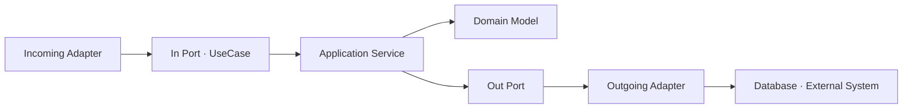
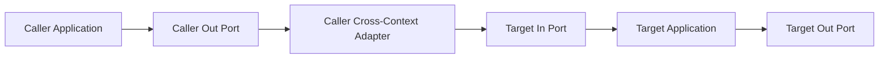

# DDD + 헥사고날 아키텍처

- Status: Active
- Audience: Engineers
- Source of Truth: Yes
- Last Reviewed: 2026-07-10

## 목적

이 문서는 `piku-back`의 현재 도메인 구조를 DDD와 헥사고날 아키텍처 관점에서 설명하고, 신규 코드와 기존 코드 개선에 적용할 의존 규칙을 정의한다.

이 문서는 기존 Aggregate, 데이터 모델, API 또는 인증 방식을 새로 설계하는 문서가 아니다. 현재 구현이 아래 규칙을 따르지 않는 위치는 [DDD + 헥사고날 아키텍처 미비점 분석](ddd-hexagonal-architecture-gap-analysis.md)에서 관리하고, 기능 변경 시 관련 범위에서 점진적으로 개선한다.

전체 모듈의 책임과 관계는 [Bounded Context Map](bounded-context-map.md), 각 도메인 내부 모델과 비즈니스 규칙은 [Domain Models](../domain-models/README.md)를 함께 참고한다.

## 용어

- **Bounded Context**: 하나의 일관된 도메인 언어와 모델, 상태 변경 책임을 갖는 경계다.
- **In Port**: 외부 호출자가 Application 유스케이스를 실행하기 위한 진입 계약이다.
- **Out Port**: Application이 저장소, 다른 Context 또는 외부 시스템의 능력을 사용하기 위해 정의하는 계약이다.
- **Incoming Adapter**: HTTP, Scheduler 등 외부 입력을 In Port 호출로 변환한다.
- **Outgoing Adapter**: Out Port를 저장소, 외부 SDK 또는 다른 Context 호출로 구현한다.

## 1. Context와 모델 소유권

### HEX-CTX-001 · 모델 소유권

- 각 비즈니스 상태와 불변식은 이를 관리하는 하나의 Context가 소유한다.
- 다른 Context는 필요한 식별자와 공개 계약을 사용할 수 있지만 대상 Entity나 Repository를 직접 조회·변경하지 않는다.
- Context 분류는 패키지를 새로 나누기 위한 지시가 아니라 현재 책임과 의존 방향을 판단하기 위한 기준이다.
- 새로운 Aggregate 분리나 Context 재편이 필요하면 이 문서에 바로 추가하지 않고 별도 설계에서 타당성과 마이그레이션 범위를 결정한다.

### HEX-CTX-002 · 호출 순환 금지

- 하나의 유스케이스 호출 흐름이 이미 거친 Context로 다시 진입하는 순환 호출을 만들지 않는다.
- 양방향 의존이 필요하면 각 방향의 호출 목적을 분리하고, 하나의 요청에서 재진입이 발생하지 않는지 확인한다.

## 2. 계층 책임과 의존 방향

### HEX-LAYER-001 · 계층 책임

| 계층 | 책임 | 허용 의존성 | 금지 의존성 |
| --- | --- | --- | --- |
| `domain` | Entity, Value Object, Domain Service와 비즈니스 규칙 | 같은 Context의 Domain 타입, Java 표준 타입, 현재 사용 중인 JPA 매핑 Annotation | Application, Adapter, 다른 Context, Spring Data, Web, 외부 SDK |
| `application` | 유스케이스 조정, Port 정의, 트랜잭션 경계 | 같은 Context의 Domain과 Port, Java 표준 타입, 허용된 Spring 구성 Annotation | Adapter 구현, Web DTO, Repository 구현, 외부 SDK, 다른 Context의 내부 타입 |
| `adapter/in` | HTTP·Scheduler 등의 입력을 In Port 호출로 변환 | 같은 Context의 In Port와 Application 계약, 입력 기술 타입 | 구체 Application Service, Out Port 직접 호출, Persistence Adapter |
| `adapter/out` | Out Port를 저장소·외부 시스템으로 구현 | 같은 Context의 Out Port와 필요한 기술 타입 | 다른 Context의 내부 Domain과 저장 계층 |
| `adapter/out/crosscontext` | 호출 Context의 계약을 대상 Context의 In Port 호출로 변환 | 호출 Context의 Out Port, 대상 Context가 공개한 In Port와 Application 계약 | 대상 Context의 Entity, Out Port, Repository, Persistence Adapter |

의존 방향은 Incoming Adapter에서 In Port로, Application Service에서 Domain과 Out Port로, Outgoing Adapter에서 외부 기술로 향한다. Domain과 Application은 Adapter 구현을 알지 않는다.

### HEX-LAYER-002 · 프레임워크 사용 범위

- Application Service 구성과 로컬 트랜잭션 선언을 위한 Spring `Service`, `Transactional` Annotation은 허용한다.
- Application은 Spring Security 구현체, Spring Data 예외, HTTP 타입, 파일 시스템 API, 공급자 SDK와 트랜잭션 동기화 API를 직접 해석하거나 제어하지 않는다.
- 암호화, 토큰, 파일, 메시지 전송, 커밋 이후 실행처럼 구현 기술에 따라 달라지는 능력은 Out Port 뒤에 둔다.

### HEX-DOMAIN-001 · Domain의 JPA 허용 범위

- 현재 모듈러 모놀리스에서는 Domain Entity에 `jakarta.persistence` 매핑 Annotation을 둘 수 있다.
- 이 허용은 Spring Data Repository, `EntityManager`, 쿼리와 Persistence Projection을 Domain에서 사용할 수 있다는 뜻이 아니다.
- Domain의 상태 변경과 규칙은 Persistence Context 없이 단위 테스트할 수 있어야 한다.

## 3. 기본 호출 흐름

### HEX-FLOW-001 · 같은 Context 내부 흐름

- Incoming Adapter는 입력을 Application 계약으로 변환한 뒤 In Port만 호출한다.
- Application Service는 유스케이스 순서와 트랜잭션을 조정하고, 비즈니스 상태 변경은 Domain 행위로 수행한다.
- 저장소와 외부 기술은 Out Port 뒤에 위치한다.

## 4. Port 계약

### HEX-PORT-IN-001 · In Port

- In Port 인터페이스 이름은 `UseCase`로 끝낸다.
- 연산 이름은 외부 요청이 수행하려는 명령이나 조회 의도를 드러낸다.
- 입력과 출력은 Application이 소유한 Command, Query, Result 또는 Read Model로 정의한다.
- Web Request·Response DTO, Cookie, Servlet, Security Principal 같은 입력 기술 타입을 포함하지 않는다.
- 다른 Context가 사용하는 In Port도 같은 `application/port/in` 규칙을 따르며, 공개 범위가 불분명하면 계약과 사용처를 문서 또는 코드 구조로 명확히 한다.

### HEX-PORT-OUT-001 · Out Port

- Out Port 인터페이스 이름은 `Port`로 끝낸다.
- `LoadUserForDiaryPort`처럼 대상과 호출 목적을 명시한다.
- Aggregate 저장과 조회를 담당하는 Persistence Out Port는 책임이 명확하고 좁다면 `load`, `save`, `delete` 용어를 사용할 수 있다.
- 메서드명에 `find`, `save`가 포함됐다는 이유만으로 위반으로 판정하지 않는다. 계약의 응집도, 호출자 관점과 기술 타입 누출 여부를 함께 판단한다.
- Spring Data 파생 쿼리 표현, 잠금 방식, 캐시 키와 공급자 이름처럼 구현 방식을 드러내는 이름은 사용하지 않는다.
- 변경 이유가 서로 다른 기능을 하나의 범용 CRUD Port에 모으지 않는다.

### HEX-PORT-OUT-002 · 계약 타입

- Port는 Java 기본 타입, 같은 Context의 Domain 타입과 Application 계약만 노출한다.
- Web, JPA, Spring Data, 외부 SDK 타입과 공급자 예외를 노출하지 않는다.
- Persistence 집계 결과는 배열이나 Tuple 대신 의미 있는 Application Read Model로 변환한다.
- Cross-Context Out Port의 입력과 출력은 호출 Context의 언어로 정의한다.

## 5. Cross-Context 통합

### HEX-XCTX-001 · 호출 Context가 경계를 소유한다

- 다른 Context의 정보나 동작이 필요한 호출 Context가 자신의 `application/port/out`에 목적이 분명한 Out Port를 정의한다.
- 호출 Context가 자신의 `adapter/out/crosscontext`에서 해당 Out Port를 구현한다.
- Adapter 이름은 가능한 경우 `{Target}AdapterFor{Caller}`처럼 호출 방향을 드러낸다.
- 한 유스케이스에서 여러 Context의 정보가 필요하면 Application Service가 각 Out Port의 결과를 조합한다.

### HEX-XCTX-002 · 대상 Context의 공개 계약만 사용한다

- Cross-Context Adapter는 대상 Context가 `application/port/in`으로 공개한 In Port와 Application 계약을 호출한다.
- 대상 Context의 Entity, Out Port, Repository, Persistence Adapter에 직접 의존하지 않는다.
- 호출 Context의 Application Service와 Out Port에는 대상 Context의 내부 타입을 노출하지 않는다.
- 대상 공개 계약을 별도 패키지로 분리할지는 실제 공개 계약 수와 변경 필요에 따라 결정하며, 이 문서는 신규 패키지 도입을 강제하지 않는다.

### HEX-XCTX-003 · 호출 흐름

Cross-Context Adapter는 대상 Context의 공개 계약을 호출 Context가 이해하는 타입과 의미로 변환하는 경계다.

## 6. 오류와 트랜잭션 경계

### HEX-ERROR-001 · 오류 번역

- 외부 SDK와 저장 기술의 예외는 Outgoing Adapter에서 Application이 이해하는 실패 의미로 변환한다.
- Cross-Context Adapter는 대상 Context의 실패를 호출 Context가 이해하는 결과 또는 Application 오류로 변환한다.
- Incoming Web Adapter는 Application 오류를 RFC 9457 Problem Details로 변환한다.
- Domain과 Application은 HTTP 상태와 Problem Details 타입을 알지 않는다.

### HEX-TX-001 · 로컬 트랜잭션

- 현재 단일 애플리케이션과 단일 데이터베이스 안의 유스케이스는 필요한 범위에서 Spring 로컬 트랜잭션을 사용한다.
- 같은 데이터베이스를 사용하는 동기 Cross-Context 호출은 트랜잭션에 참여할 수 있지만, 반드시 대상 In Port를 거쳐야 하며 대상 Repository나 Entity 직접 접근을 허용하지 않는다.
- 외부 API, 이메일, 파일 저장소 작업은 데이터베이스 롤백으로 되돌릴 수 있다고 가정하지 않는다.

### HEX-TX-002 · 커밋 이후 부가 작업

- 핵심 성공 결과를 되돌리지 않아야 하는 알림 전송 등의 부가 작업은 커밋 이후 실행할 수 있다.
- Application Service는 Spring 트랜잭션 동기화 API를 직접 사용하지 않고 필요한 실행 능력을 Out Port로 요청한다.
- 현재 서비스에서 실패를 허용하는 부가 작업은 best-effort로 처리할 수 있다.
- 이벤트와 Outbox는 현재 기본 규칙이 아니다. 전달 보장, 재시도 또는 독립 배포 요구가 생기면 별도 설계에서 검토한다.

## 7. Persistence와 검증

### HEX-PERSIST-001 · 저장소 세부사항 격리

- JPA Repository와 Persistence Projection은 `adapter/out/persistence` 안에 둔다.
- Adapter는 배열, Tuple, DB 컬럼 순서와 공급자 타입을 Domain 또는 Application의 의미 있는 타입으로 변환한다.
- 잠금과 조회 최적화는 Persistence Adapter가 구현하되, Application 계약에는 기술 이름이 아닌 필요한 비즈니스 의미를 표현한다.

### HEX-TEST-001 · 자동 검증

- Domain, Application, Adapter의 의존 방향을 공통 아키텍처 테스트로 검증한다.
- In Port의 `UseCase`, Out Port의 `Port` 접미사와 Cross-Context Adapter 표준 위치를 검증한다.
- Application의 다른 Context 직접 의존과 Port 계약의 Web·JPA·SDK·대상 내부 타입 누출을 검증한다.
- 현재 구현상 예외는 갭 분석에 근거 위치와 제거 조건을 기록하고, 신규 코드에서 예외 범위를 확대하지 않는다.

## 적용 원칙

- 이 규칙은 신규 기능과 변경되는 코드에 우선 적용한다.
- 규칙 준수를 이유로 관련 없는 Aggregate, 테이블, API 또는 패키지를 한 번에 재설계하지 않는다.
- 기존 미비점은 기능 우선순위와 변경 범위에 맞춰 점진적으로 개선한다.
- 구조 변경이 기능 동작이나 데이터 마이그레이션을 요구하면 별도 설계와 검증 없이 진행하지 않는다.
