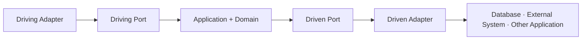

# 헥사고날 아키텍처 원칙

- Status: Active
- Audience: Engineers
- Source of Truth: Yes
- Last Reviewed: 2026-07-11

## 목적

이 문서는 `piku-back`에서 헥사고날 아키텍처(Ports and Adapters)를 적용할 때 사용하는 구조 원칙을 정의한다.

헥사고날 아키텍처의 핵심은 위·아래 계층 수가 아니라 Application의 inside와 외부 기술의 outside를 분리하는 것이다. Application은 목적이 분명한 Port를 통해 외부와 대화하고, Adapter는 기술별 표현을 Port의 프로토콜로 변환한다.

## 1. Application 경계

### HEX-BOUNDARY-001 · inside와 outside를 분리한다

- inside는 유스케이스와 비즈니스 규칙을 기술과 무관하게 실행할 수 있어야 한다.
- HTTP, Scheduler, 데이터베이스, 파일 시스템, 메시징, 보안 프레임워크와 외부 SDK는 outside에 둔다.
- inside가 특정 outside 구현 없이 테스트될 수 있어야 한다.
- 같은 프로세스 안의 다른 모델도 현재 Application 경계 밖에 있다면 외부 협력자로 취급할 수 있다.
- 헥사고날 경계와 Bounded Context는 자동으로 일치하지 않는다. DDD가 모델 경계를 결정하고 헥사고날 구조가 그 경계를 기술 의존으로부터 보호한다.

### HEX-DEPENDENCY-001 · 의존성은 inside가 정한 계약을 향한다

- Driving Adapter는 Application이 제공하는 Port를 호출한다.
- Application이 외부 협력자에게 필요한 능력은 Application 관점의 Port로 표현한다.
- Driven Adapter는 그 Port를 데이터베이스, 외부 서비스 또는 다른 Application 호출로 구현한다.
- Application은 Adapter 구현, Web DTO, Repository 구현과 공급자 SDK를 직접 알지 않는다.

## 2. Port와 Adapter

### HEX-PORT-001 · Port는 목적 있는 대화다

- Port는 기술 장치가 아니라 Application과 외부 행위자 사이의 목적 있는 대화와 프로토콜을 표현한다.
- Port 이름과 연산은 호출 의도, 입력, 결과와 실패 의미를 드러낸다.
- Port 하나를 유스케이스 하나와 항상 일대일로 만들거나 모든 유스케이스를 하나의 Port에 모으는 극단을 피한다.
- Port 분할은 외부 행위자, 변경 이유, 보안·트랜잭션 경계와 대체 가능성을 근거로 결정한다.
- 인터페이스 수나 메서드 수만으로 응집도를 판정하지 않는다.

### HEX-ADAPTER-001 · Adapter가 표현과 기술을 변환한다

- Driving Adapter는 HTTP·Scheduler·테스트 등의 입력을 Application 입력으로 변환한다.
- Driven Adapter는 Application 요청을 JPA, SDK, 파일, 메시지 또는 다른 Application의 계약으로 변환한다.
- 기술 예외, 공급자 타입, DB Projection과 전송 DTO는 Adapter 안에서 Application 의미로 바꾼다.
- 하나의 Port에는 운영 구현, 테스트 대역, 다른 공급자 구현처럼 여러 Adapter가 연결될 수 있다.

## 3. 기본 상호작용

`In Port`와 `Out Port`는 이 저장소에서 각각 Driving Port와 Driven Port를 구분하기 위해 사용하는 명칭이다. 이 접미사와 패키지 위치는 프로젝트 규약이며 헥사고날 아키텍처의 보편적 정의는 아니다.

## 4. 다른 Context 또는 Application과 통합

### HEX-INTEGRATION-001 · 통합 계약과 모델 번역을 명시한다

다른 Context와의 통합에는 다음 방식이 있을 수 있다.

- 같은 프로세스의 공개 Application Port 호출
- HTTP·gRPC 등 Open Host Service와 Published Language 사용
- 메시지 또는 공개 이벤트 구독
- 필요한 경우 Anti-Corruption Layer를 통한 모델 번역
- 의도적으로 작은 Shared Kernel 사용

어떤 방식을 선택하든 다음 원칙을 지킨다.

- 소비자는 공급자의 내부 Entity, Repository와 Persistence Adapter를 직접 사용하지 않는다.
- 공개 계약과 내부 모델의 변경 범위를 구분한다.
- 소비자 모델을 보호해야 하면 소비자 관점의 Port와 Adapter에서 번역한다.
- 단순한 데이터 전달이고 모델 의미가 안정적으로 공유된다면 불필요한 번역 계층을 만들지 않는다.
- 동기 직접 호출, API와 이벤트 중 무엇을 사용할지는 일관성, 결합, 실패 처리, 지연과 배포 요구를 근거로 결정한다.

대상의 `application/port/in`을 같은 프로세스에서 호출하는 방식은 현재 저장소의 기본 선택지 중 하나지만 유일한 헥사고날 통합 방식은 아니다.

## 5. 오류 경계

### HEX-ERROR-001 · 실패 의미를 경계에서 번역한다

- 외부 SDK와 저장 기술 예외는 Driven Adapter에서 Application이 이해하는 실패로 변환한다.
- 다른 Context의 실패는 필요할 때 소비자 Context의 의미로 번역한다.
- Application과 Domain은 HTTP 상태와 Problem Details 타입을 알지 않는다.
- Web Adapter는 Application 실패를 저장소의 API 오류 응답 표준에 따라 RFC 9457 Problem Details로 변환한다.

RFC 9457은 헥사고날 아키텍처 자체의 요구가 아니라 이 저장소의 Web Adapter 표준이다.

## 6. 트랜잭션과 부가 작업

### HEX-TRANSACTION-001 · 기술적 실행 시점을 Application에서 격리한다

- Application은 유스케이스의 원자성과 일관성 요구를 표현한다.
- 로컬 트랜잭션 선언은 사용할 수 있지만 Spring 트랜잭션 동기화 API를 직접 제어하지 않는다.
- 외부 API, 이메일, 푸시와 파일 작업은 데이터베이스 롤백으로 되돌릴 수 있다고 가정하지 않는다.
- 커밋 이후 실행, 재시도, 중복 방지와 전달 보장은 Adapter 또는 별도 메시징 메커니즘이 담당한다.
- Outbox와 비동기 이벤트는 요구가 있을 때 선택하며 헥사고날 적용의 필수 조건으로 두지 않는다.

## 7. 검증

- Domain과 Application 단위 테스트는 Web 서버, 실제 DB와 외부 공급자 없이 실행할 수 있어야 한다.
- Adapter 계약 테스트는 기술별 변환, 오류 번역과 실제 통합을 검증한다.
- 아키텍처 테스트는 금지 의존과 패키지 규약을 검증하되 Port의 의미와 모델 품질까지 검증한다고 간주하지 않는다.
- 테스트 대역을 만들기 어렵다면 Port가 기술 타입을 노출하거나 책임이 불명확한지 먼저 확인한다.

## 참고 기준

- [Alistair Cockburn, Hexagonal Architecture](https://alistair.cockburn.us/hexagonal-architecture)
