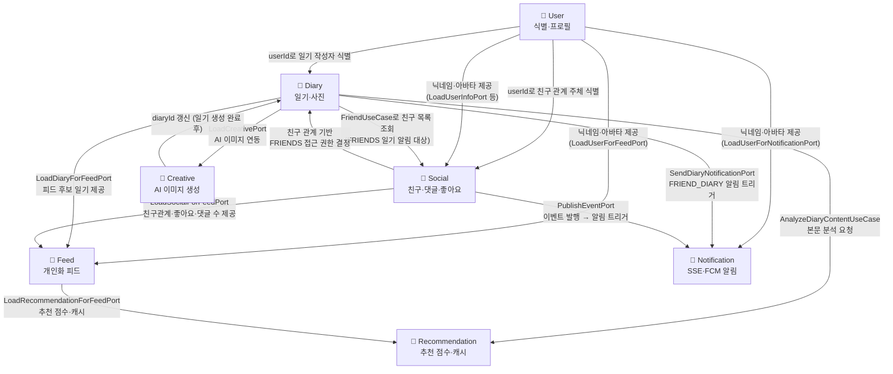

# 도메인 모델 (Domain Models)

- Status: Active
- Audience: Engineers
- Source of Truth: Yes
- Last Reviewed: 2026-04-12

이 디렉토리는 `piku-back` 프로젝트의 도메인 모델링 문서를 포함합니다.
각 문서는 DDD 원칙에 따라 **도메인 개요 → 엔티티/VO → 상태 → 행위 → 규칙** 순서로 기술합니다.

---

## 도메인 문서 목록

| 도메인           | 핵심 역할                              | 문서                               |
| ---------------- | -------------------------------------- | ---------------------------------- |
| **Diary**        | 일기 작성, 사진 첨부, 공개 범위 제어   | [diary.md](diary.md)               |
| **User**         | 사용자 식별, 프로필 관리, 닉네임 점유  | [user.md](user.md)                 |
| **Social**       | 친구 관계, 댓글, 좋아요, 이벤트 발행   | [social.md](social.md)             |
| **Feed**         | 개인화 피드 구성, 열람 행위 이력 수집  | [feed.md](feed.md)                 |
| **Notification** | SSE/FCM 이중 알림 발송, 기기 토큰 관리 | [notification.md](notification.md) |

---

## 도메인 관계도

### 핵심 흐름 요약

| 시나리오         | 흐름                                                                                    |
| ---------------- | --------------------------------------------------------------------------------------- |
| **일기 작성**    | `Diary` → (친구 목록) `Social` → (알림) `Notification` → (분석) `Recommendation`        |
| **피드 조회**    | `Feed` → `Diary` + `Social`(좋아요·댓글) + `User`(닉네임) + `Recommendation`(추천 캐시) |
| **친구 요청**    | `Social` → (이벤트 발행) → `Notification`                                               |
| **AI 일기 생성** | `Creative` → (이미지 연동) → `Diary`                                                    |

---

> **참고**: 각 문서는 DDD(Domain-Driven Design) 원칙에 입각하여
> 상태, 속성, 행위, 규칙을 분리하여 기술하고 있습니다.
