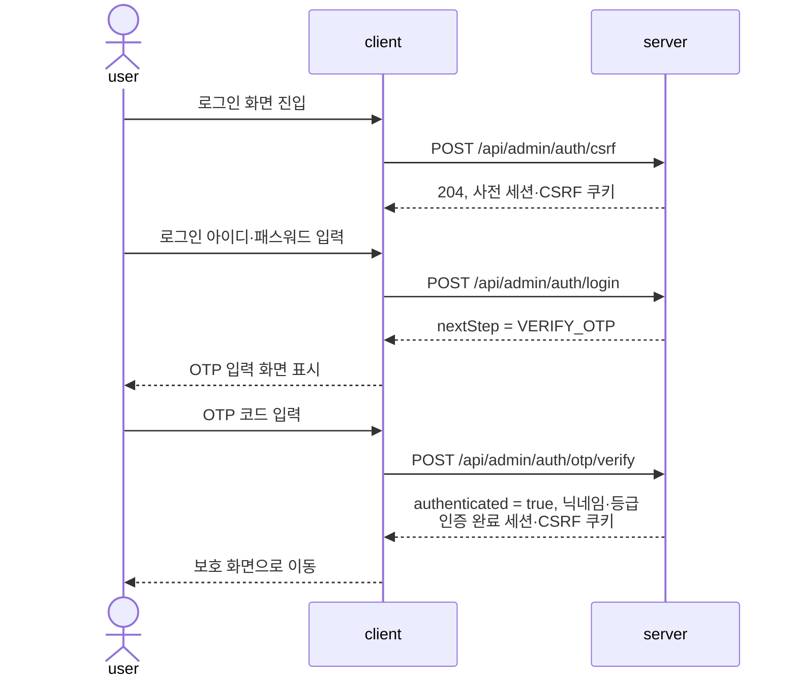
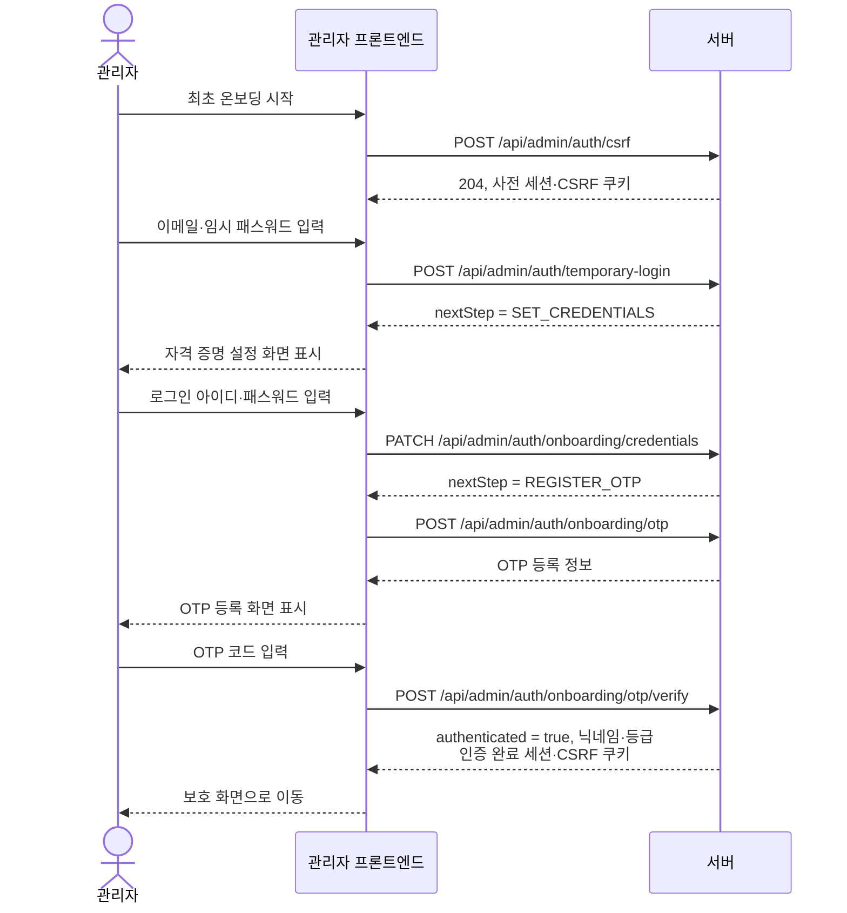

# 관리자 세션 인증 프론트엔드 Handoff

- Status: Active
- Audience: Backend Engineers, Frontend Engineers
- Source of Truth: Yes
- Last Reviewed: 2026-06-21

## 목적

관리자 프론트엔드가 서버 세션 쿠키와 CSRF 토큰을 사용해 로그인, 최초 온보딩, 보호 API 호출, 로그아웃을 구현하기 위한 계약을 정의한다.

이 문서는 관리자 인증의 현재 동작만 다룬다. 관리자 프론트엔드는 서버가 관리하는 세션 단계와 API 응답을 기준으로 화면 상태를 결정한다.

## 연동 요약

- 모든 관리자 API 요청은 브라우저가 쿠키를 함께 전송하도록 설정한다.
- 관리자 세션 쿠키는 HttpOnly이므로 프론트엔드에서 읽거나 직접 생성하지 않는다.
- CSRF 쿠키는 프론트엔드에서 읽고, 안전하지 않은 요청의 CSRF 헤더 값으로 전달한다.
- 로그인과 최초 온보딩을 시작하기 전에 CSRF 초기화 API로 사전 세션을 생성한다.
- 로그인 및 온보딩의 다음 화면은 응답의 `nextStep`을 기준으로 결정한다.
- OTP 검증 성공 후 `authenticated`, 닉네임, 등급으로 인증 완료 상태를 갱신한다.
- 인증 완료 여부를 쿠키 존재 여부로 추정하지 않는다.

## 세션 초기화 기준

`POST /api/admin/auth/csrf`는 로그인 또는 최초 온보딩 흐름을 시작할 때 호출한다. 서버는 204 응답과 함께 사전 세션 쿠키와 CSRF 쿠키를 발급한다.

이미 인증된 관리자 화면을 초기화할 때 이 API를 무조건 호출하지 않는다. 호출하면 새 사전 세션이 발급되므로 기존 인증 상태를 유지할 수 없다.

다음 상황에서는 새 사전 세션을 초기화한다.

- 로그인 화면을 처음 표시할 때
- 로그아웃 완료 후 다시 로그인 화면으로 이동할 때
- 보호 API에서 세션 만료 또는 폐기를 의미하는 401 응답을 받은 뒤 로그인 화면으로 이동할 때
- CSRF 검증 실패 후 진행 중인 변경 요청을 중단하고 인증 흐름을 다시 시작할 때

## 정식 로그인 흐름

1. CSRF 초기화 API를 호출해 사전 세션을 생성한다.
2. `POST /api/admin/auth/login`으로 로그인 아이디와 패스워드를 전송한다.
3. 응답의 `nextStep`이 `VERIFY_OTP`이면 OTP 입력 화면으로 이동한다.
4. `POST /api/admin/auth/otp/verify`로 OTP 코드를 전송한다.
5. OTP 검증 성공 시 서버가 세션 쿠키와 CSRF 쿠키를 교체한다.
6. 응답의 `authenticated`가 true이면 닉네임과 등급을 저장하고 보호 화면으로 이동한다.

로그인 응답은 `nextStep`만 반환한다. 닉네임과 `role`은 OTP 검증 성공 응답에서 제공하며, OTP 검증 전에는 보호 API를 호출할 수 없다. 인증 응답은 관리자 이메일과 로그인 아이디를 반환하지 않는다.

## 최초 온보딩 흐름

1. CSRF 초기화 API를 호출해 사전 세션을 생성한다.
2. `POST /api/admin/auth/temporary-login`으로 이메일과 임시 패스워드를 전송한다.
3. 응답의 `nextStep`이 `SET_CREDENTIALS`이면 자격 증명 설정 화면으로 이동한다.
4. `PATCH /api/admin/auth/onboarding/credentials`로 로그인 아이디와 패스워드를 함께 설정한다.
5. 응답의 `nextStep`이 `REGISTER_OTP`이면 OTP 등록 화면으로 이동한다.
6. `POST /api/admin/auth/onboarding/otp`를 호출해 OTP 등록 정보를 받는다.
7. 인증 앱 등록 후 `POST /api/admin/auth/onboarding/otp/verify`로 OTP 코드를 전송한다.
8. OTP 검증 성공 시 서버가 세션 쿠키와 CSRF 쿠키를 교체한다.
9. 응답의 `authenticated`가 true이면 닉네임과 등급을 저장하고 보호 화면으로 이동한다.

로그인 아이디와 패스워드는 하나의 요청으로 설정한다. 임시 로그인 응답은 이메일과 로그인 아이디를 반환하지 않는다. OTP 등록 응답의 계정명은 서버가 발급한 관리자 고유 식별값을 사용한다. 발급자, 계정명, 등록 URI, 수동 입력 키는 OTP 등록 화면에서만 사용하며 인증 완료 후 보관하지 않는다.

## API 계약

| API | 접근 조건 | 프론트엔드 처리 |
| --- | --- | --- |
| `POST /api/admin/auth/csrf` | 허용된 Origin | 사전 세션과 CSRF 쿠키를 받은 뒤 로그인 또는 온보딩 시작 |
| `POST /api/admin/auth/temporary-login` | 사전 세션, CSRF, Origin | `nextStep`, 닉네임, 등급 반영 |
| `PATCH /api/admin/auth/onboarding/credentials` | 온보딩 자격 증명 설정 단계, CSRF, Origin | `nextStep`에 따라 OTP 등록 화면으로 이동 |
| `POST /api/admin/auth/onboarding/otp` | 온보딩 OTP 등록 단계, CSRF, Origin | OTP 등록 정보 표시 |
| `POST /api/admin/auth/onboarding/otp/verify` | 온보딩 OTP 검증 단계, CSRF, Origin | 인증 완료 상태, 닉네임, 등급 반영 |
| `POST /api/admin/auth/login` | 사전 세션, CSRF, Origin | `nextStep`에 따라 OTP 입력 화면으로 이동 |
| `POST /api/admin/auth/otp/verify` | 로그인 OTP 검증 단계, CSRF, Origin | 인증 완료 상태, 닉네임, 등급 반영 |
| `POST /api/admin/auth/logout` | 인증 완료 세션, CSRF, Origin | 로컬 관리자 상태를 비우고 로그인 화면으로 이동 |
| `PATCH /api/admin/auth/password` | 인증 완료 세션, CSRF, Origin | 성공 후 로컬 관리자 상태를 비우고 다시 로그인 |

서버는 사전 세션의 현재 단계와 요청 API가 일치하는지 검증한다. 프론트엔드는 사용자가 URL을 직접 이동하더라도 서버가 허용한 `nextStep` 순서를 건너뛰어 요청하지 않는다.

## 관리자 식별자 노출 기준

- 인증과 온보딩 응답은 관리자 이메일과 로그인 아이디를 반환하지 않는다.
- OTP 검증 성공 응답의 관리자 정보는 닉네임과 등급만 포함한다.
- 관리자 생성과 임시 패스워드 재발급 응답은 이메일과 로그인 아이디를 반환하지 않는다.
- `SUPER_ADMIN`의 관리자 목록과 상세 조회에서만 이메일과 로그인 아이디를 반환하며, 두 값은 마스킹된 표시용 값이다.
- 관리자 목록은 상세 조회에 사용할 `adminId`를 포함하고, 상세 조회는 `GET /api/admin/accounts/{adminId}`를 사용한다.
- 이메일은 로컬 파트 앞 두 글자와 도메인만 유지한다. 예: `op***@pikume.com`
- 로그인 아이디는 앞 두 글자와 뒤 두 글자만 유지한다. 예: `op***ne`
- 프론트엔드는 마스킹된 값을 인증, 변경 요청, 관리자 식별 키로 사용하지 않는다.
- 신규 감사 로그에는 이메일 원문이나 마스킹 값을 저장하지 않는다.

## 요청 설정

- 관리자 API 요청에는 브라우저 자격 증명을 항상 포함한다.
- GET, HEAD, OPTIONS를 제외한 요청에는 CSRF 쿠키 값을 지정된 CSRF 헤더에 전달한다.
- CSRF 초기화 API는 기존 CSRF 값 없이 호출할 수 있다.
- 쿠키와 CSRF 헤더의 실제 이름은 배포 환경 설정과 Swagger 보안 스키마를 기준으로 사용한다.
- 프론트엔드는 쿠키와 헤더 이름을 인증 의미가 드러나는 자체 이름으로 바꾸거나 별도 이름을 가정하지 않는다.
- 상태 변경 요청 실패 시 동일 요청을 자동 재전송하지 않는다.

## 쿠키와 세션 수명

- 사전 세션 쿠키의 유효시간은 10분이다.
- 인증 완료 세션의 절대 유효시간은 로그인 완료 후 최대 8시간이다.
- 인증 완료 세션은 마지막 활동 후 30분 동안 요청이 없으면 만료된다.
- 세션 쿠키는 관리자 API 경로에만 전송되며 HttpOnly, Secure, SameSite Strict 정책을 사용한다.
- CSRF 쿠키는 프론트엔드가 읽을 수 있으며 Secure, SameSite Strict 정책을 사용한다.
- OTP 검증 성공 시 사전 세션 쿠키와 CSRF 쿠키는 인증 완료용 값으로 교체된다.
- 한 관리자 계정은 하나의 활성 인증 완료 세션만 유지한다.
- 로그아웃과 패스워드 변경은 현재 인증 상태를 무효화한다.

## 프론트엔드 인증 상태

프론트엔드는 최소한 다음 상태를 구분한다.

| 상태 | 진입 기준 | 허용 화면 |
| --- | --- | --- |
| 로그인 필요 | 초기 로그인 화면 또는 세션 무효화 | 로그인, 최초 온보딩 시작 |
| 자격 증명 설정 | `nextStep`이 `SET_CREDENTIALS` | 로그인 아이디와 패스워드 설정 |
| OTP 등록 | `nextStep`이 `REGISTER_OTP` | OTP 등록 정보 표시 |
| OTP 검증 | `nextStep`이 `VERIFY_OTP` | OTP 코드 입력 |
| 인증 완료 | `authenticated`가 true | 관리자 보호 화면 |

브라우저 새로고침 후 인증 여부는 쿠키를 읽어 판단하지 않는다. 보호 API 응답이 성공하면 인증 상태를 유지하고, 401이면 로컬 관리자 상태를 비운 뒤 로그인 흐름을 다시 시작한다.

## 오류 처리

관리자 인증, Origin, CSRF, 권한 오류는 RFC 9457 Problem Details 형식이다. 프론트엔드는 문자열 비교 대신 `status`와 `type`을 기준으로 분기한다.

| 상황 | 상태 | 프론트엔드 처리 |
| --- | --- | --- |
| 입력 형식 또는 현재 세션 단계 오류 | 400 | 현재 화면에 요청 오류 표시 |
| 로그인 정보, OTP, 임시 자격 증명 또는 세션 오류 | 401 | `type`에 따라 입력 오류를 표시하거나 로그인 상태 초기화 |
| Origin, CSRF 또는 관리자 권한 오류 | 403 | 요청을 중단하고 권한 또는 인증 흐름 복구 |
| 로그인 아이디 중복 | 409 | 자격 증명 설정 화면에 중복 오류 표시 |
| 계정 잠금 | 423 | 잠금 상태를 안내하고 반복 요청 중단 |
| OTP 일시 차단 | 429 | OTP 입력과 자동 재시도 중단 |
| 관리자 인증 저장소 확인 불가 | 503 | 장애 상태를 표시하고 즉시 반복 요청하지 않음 |

보호 API에서 401을 받으면 로컬 관리자 정보와 진행 중인 인증 단계를 비우고 로그인 화면으로 이동한다. 로그인 화면에서 새 CSRF 초기화를 수행한다.

CSRF 관련 403을 받은 상태 변경 요청은 자동 재전송하지 않는다. 사용자가 작성한 입력을 보존할 필요가 있으면 민감정보를 제외한 화면 입력만 임시 유지하고, 새 인증 흐름이 완료된 뒤 사용자가 다시 제출하도록 한다.

## QA 기준

- 로그인 화면 진입 시 사전 세션과 CSRF 쿠키가 발급된다.
- 정식 로그인 성공 후 OTP 검증 전에는 보호 화면에 진입하지 않는다.
- 최초 온보딩은 자격 증명 설정, OTP 등록, OTP 검증 순서로만 진행된다.
- OTP 검증 성공 후 보호 API 호출이 성공한다.
- 인증된 관리자 화면 새로고침 시 CSRF 초기화 API를 자동 호출하지 않는다.
- 안전하지 않은 요청에는 CSRF 쿠키와 동일한 값의 CSRF 헤더가 포함된다.
- 로그아웃 후 보호 API 호출은 거부되고 로그인 화면으로 이동한다.
- 패스워드 변경 후 현재 인증 상태를 비우고 다시 로그인한다.
- 세션 만료 후 보호 API의 401 응답으로 로그인 흐름이 다시 시작된다.
- CSRF 오류가 발생한 상태 변경 요청은 자동 재전송되지 않는다.
