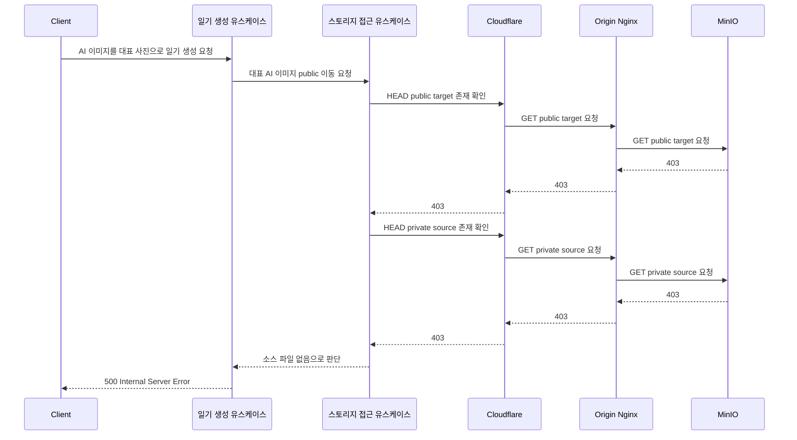
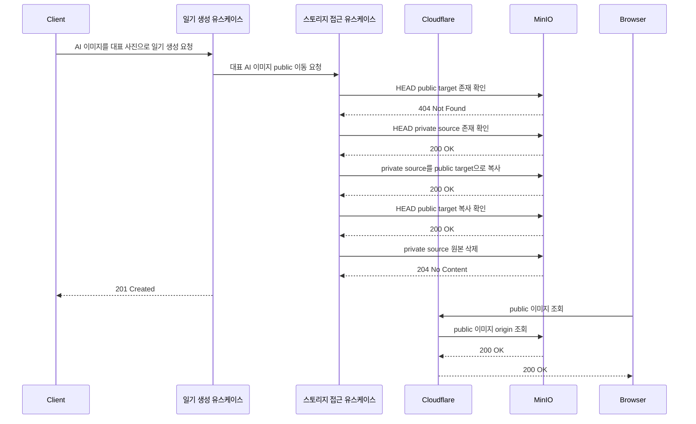

# MinIO Cloudflare HeadObject Incident

- Status: Draft
- Audience: Engineers
- Source of Truth: No
- Last Reviewed: 2026-05-28

## 목적

이 문서는 AI 이미지 기반 일기 생성 중 MinIO 객체 확인 단계에서 403이 발생해 일기 생성이 실패한 장애의 발생 상황, 원인, 가능한 해결 방안을 정리한다.

## 장애 발생 상황

AI 이미지로 일기를 생성할 때 간헐적으로 일기 생성 API가 500을 반환했다. 사용자는 같은 AI 이미지를 잠시 뒤 다시 저장하면 성공하는 현상을 경험했다.

장애가 발생한 사용자 흐름은 다음과 같다.

1. 사용자가 AI 일기 이미지를 생성한다.
2. 이미지 생성 유스케이스가 생성된 이미지를 MinIO private 경로에 저장한다.
3. 이미지 생성 유스케이스가 AI 이미지 ID와 미리보기 URL을 클라이언트에 반환한다.
4. 사용자가 해당 AI 이미지를 대표 사진으로 포함해 일기 생성을 요청한다.
5. 일기 생성 유스케이스가 대표 AI 이미지를 public 경로로 이동하려 한다.
6. public 이동 유스케이스가 객체 존재 여부를 확인하는 단계에서 MinIO가 403을 반환한다.
7. 애플리케이션은 403을 객체 없음으로 처리하고, “소스 파일 없음” 예외로 일기 생성을 실패 처리한다.
8. 클라이언트는 500 Problem Details 응답을 받는다.

대표 장애 로그:

```text
객체 존재 확인 중 오류: null (Service: S3, Status Code: 403 ...)
소스 파일이 존재하지 않습니다: <user-id>/20260526_160952_4899aa65.png
파일 이동 중 예상하지 못한 오류 발생: 소스 파일을 찾을 수 없습니다: ...
```

실패 시 nginx access log의 핵심 흐름:

```text
GET  /<bucket>/public/<user-id>/20260527_153540_5c92fc75.png 403 "aws-sdk-java/2.25.19 ..."
GET  /<bucket>/<user-id>/20260527_153540_5c92fc75.png        403 "aws-sdk-java/2.25.19 ..."
POST /api/diary                                              500
```

정상 시 nginx access log의 핵심 흐름:

```text
HEAD   /<bucket>/public/<user-id>/20260527_153540_5c92fc75.png 404
HEAD   /<bucket>/<user-id>/20260527_153540_5c92fc75.png        200
PUT    /<bucket>/public/<user-id>/20260527_153540_5c92fc75.png 200
HEAD   /<bucket>/public/<user-id>/20260527_153540_5c92fc75.png 200
DELETE /<bucket>/<user-id>/20260527_153540_5c92fc75.png        204
POST   /api/diary                                              201
GET    /<bucket>/public/<user-id>/20260527_153540_5c92fc75.png 200
```

성공 로그에서 원본 삭제 로그가 먼저 눈에 띄지만, 삭제가 성공 조건은 아니다. public 이동 유스케이스는 public 경로 복사와 복사 검증이 성공한 뒤 원본 private 객체를 정리한다. 삭제 로그가 먼저 보이는 이유는 복사와 객체 확인 단계에는 별도 INFO 로그가 없고, 원본 삭제 단계에 INFO 로그가 있기 때문이다.

## 원인 분석

장애의 직접 원인은 Spring 서버의 MinIO 객체 존재 확인 요청이 Cloudflare를 거치면서 일부 요청에서 origin에 `HEAD`가 아닌 `GET`으로 전달되고, 이로 인해 MinIO의 S3 서명 검증이 실패해 403이 반환된 것으로 판단한다.

근거는 다음과 같다.

1. 일기 생성 유스케이스는 대표 AI 이미지를 public 경로로 이동하기 전에 public target과 private source의 존재 여부를 확인한다.
2. 객체 존재 확인은 S3 `HeadObject` 요청이다. 따라서 origin nginx access log에는 `HEAD /<bucket>/...`가 기록되어야 한다.
3. 실패 시점에는 `aws-sdk-java` User-Agent 요청이 `HEAD`가 아니라 `GET`으로 origin에 도착했고, 두 요청 모두 403을 반환했다.
4. 동일 파일에 대한 정상 재시도에서는 `HEAD public target -> 404`, `HEAD private source -> 200`이 기록됐다. 따라서 원본 파일이 없었던 것이 아니라, 실패 시점의 요청 경로 또는 요청 변환 때문에 접근이 실패한 것이다.
5. Cloudflare는 cacheable resource에 대한 `HEAD` 요청이 cache miss일 때 origin에 `GET` 요청을 보낼 수 있다. `.png` 객체 경로는 정적 리소스로 cacheable하게 취급될 수 있다.
6. S3 SigV4 서명은 HTTP method를 포함한다. AWS SDK가 `HEAD` 기준으로 서명한 요청이 Cloudflare를 거쳐 origin에 `GET`으로 전달되면 MinIO 입장에서는 실제 method와 서명 기준 method가 달라져 403을 반환할 수 있다.

AWS S3 `HeadObject`는 객체 metadata 조회를 위한 `HEAD` 요청이며, 실패 시 403 또는 404 같은 generic status를 반환할 수 있다. `HeadObject`에는 객체 읽기 권한이 필요하고, `ListBucket` 권한이 없으면 객체 없음이 403으로 보일 수 있다. Cloudflare는 cacheable `HEAD` 요청을 origin `GET`으로 변환할 수 있다고 문서화하고 있다.

참고 문서:

- [AWS HeadObject](https://docs.aws.amazon.com/AmazonS3/latest/API/API_HeadObject.html)
- [Cloudflare Cache Behavior - HEAD requests](https://developers.cloudflare.com/cache/concepts/cache-behavior/)

### 실패 플로우



### 정상 플로우



## 해결 방안 검토 및 선정 근거

### 후보 1. 내부 네트워크 기반 endpoint 분리

#### 개요

Spring 서버가 MinIO에 접근할 때는 Cloudflare 도메인을 사용하지 않고, 같은 네트워크 안의 MinIO 내부 주소로 직접 통신한다. 클라이언트에 노출되는 이미지 조회 URL은 별도의 public URL로 유지한다.

이 방법은 MinIO와 Spring 서버가 같은 네트워크로 묶여 있기 때문에 가능한 방식이다. 서버 내부 S3 API 요청용 endpoint와 클라이언트 public URL 생성용 endpoint를 분리해, 서버의 객체 확인, 복사, 삭제 요청이 Cloudflare cache/proxy 동작의 영향을 받지 않게 한다.

예상 구조:

```text
Spring 서버 -> MinIO: 내부 네트워크 주소
Client/Browser -> public 이미지 조회: Cloudflare public 도메인
```

#### 장점

- 장애 원인인 Cloudflare의 `HEAD` to `GET` 변환 가능성을 서버 S3 API 요청 경로에서 제거한다.
- S3 API 요청이 method, host, header, signature 변형 없이 MinIO에 도달한다.
- 현재 인프라에서 MinIO와 Spring 서버가 같은 네트워크에 있으므로 적용 범위가 명확하다.
- public 이미지 조회는 기존처럼 Cloudflare를 사용할 수 있어 외부 이미지 제공 구조를 유지할 수 있다.

#### 단점

- 서버 내부 endpoint와 클라이언트 public URL을 분리해서 관리해야 한다.
- 배포 환경별로 내부 endpoint 설정이 달라질 수 있으므로 설정 관리가 필요하다.
- MinIO가 다른 네트워크로 이동하면 이 구조를 그대로 사용할 수 없다.

#### 검토 결과

현재 장애 원인은 서버의 S3 API 요청이 Cloudflare를 경유하면서 발생한다. 후보 1은 Spring 서버와 MinIO 사이의 통신 경로에서 Cloudflare를 제거하므로, 확인된 원인을 가장 직접적으로 제거한다. 현재 MinIO와 Spring 서버가 같은 네트워크에 있으므로 우선 적용하기에 가장 적합하다.

### 후보 2. 외부 endpoint 분리와 Cloudflare cache bypass 적용

#### 개요

MinIO와 Spring 서버가 서로 다른 네트워크에 있어 내부 주소로 직접 통신할 수 없다면, 서버 S3 API 요청용 endpoint와 클라이언트 public URL을 분리하되 서버 요청이 사용하는 storage host 또는 경로에 Cloudflare cache bypass를 적용한다.

서버 요청용 endpoint는 외부에서 접근 가능한 주소를 사용할 수 있지만, 해당 주소에서는 Cloudflare가 S3 API 요청을 정적 이미지 캐시 대상으로 취급하지 않도록 설정해야 한다.

대상 후보:

- 스토리지 객체 경로 전체
- MinIO API 전용 host
- `aws-sdk-java` 요청이 들어오는 storage API 경로

예상 구조:

```text
Spring 서버 -> MinIO: Cloudflare cache bypass가 적용된 storage endpoint
Client/Browser -> public 이미지 조회: Cloudflare public 도메인
```

#### 장점

- MinIO와 Spring 서버가 다른 네트워크에 있어도 적용할 수 있다.
- 서버 S3 API 요청용 endpoint와 public 이미지 조회 URL을 분리할 수 있다.
- Cloudflare를 완전히 제거하기 어려운 환경에서도 장애 발생 가능성을 낮출 수 있다.

#### 단점

- S3 API 요청이 여전히 Cloudflare를 경유한다.
- cache bypass 설정이 누락되거나 우선순위가 밀리면 같은 장애가 재발할 수 있다.
- S3 API는 method, host, header, signature에 민감하므로 프록시 계층 설정에 계속 의존한다.

#### 검토 결과

후보 2는 MinIO와 Spring 서버가 다른 네트워크에 있을 때 선택할 수 있는 현실적인 대안이다. 다만 현재 장애의 핵심 원인이 Cloudflare 경유 자체에서 발생했으므로, 같은 네트워크에서 직접 통신이 가능한 현재 환경에서는 후보 1보다 우선순위가 낮다.

### 최종 선정 방안

후보 1. 내부 네트워크 기반 endpoint 분리

### 선정 근거

현재 장애는 Spring 서버의 S3 `HeadObject` 요청이 Cloudflare를 거치면서 origin에는 `GET`으로 도착했고, 이로 인해 MinIO의 S3 서명 검증이 실패해 403이 반환된 것으로 판단된다.

후보 1은 서버와 MinIO 사이의 S3 API 요청 경로에서 Cloudflare를 제거한다. 따라서 Cloudflare cache 정책, method 변환, 프록시 헤더 처리에 영향을 받지 않고 `HEAD`, `PUT`, `DELETE` 같은 S3 API 요청을 MinIO에 그대로 전달할 수 있다.

또한 현재 MinIO와 Spring 서버는 같은 네트워크로 묶여 있으므로, 별도의 외부 도메인 추가 없이 내부 endpoint와 public URL을 분리하는 방식으로 해결할 수 있다. 외부 브라우저의 이미지 조회는 기존 Cloudflare public 도메인을 유지할 수 있어 사용자-facing 이미지 제공 구조도 크게 바꾸지 않는다.
