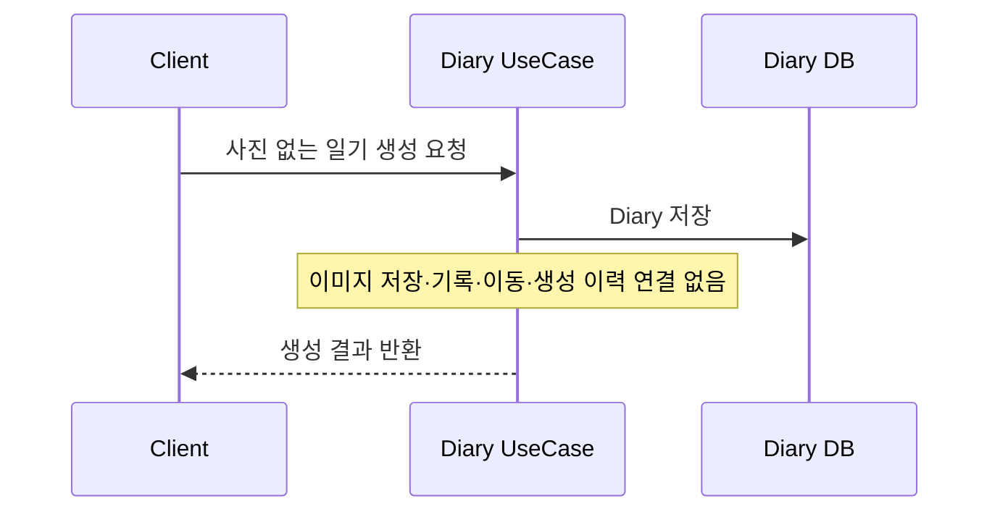
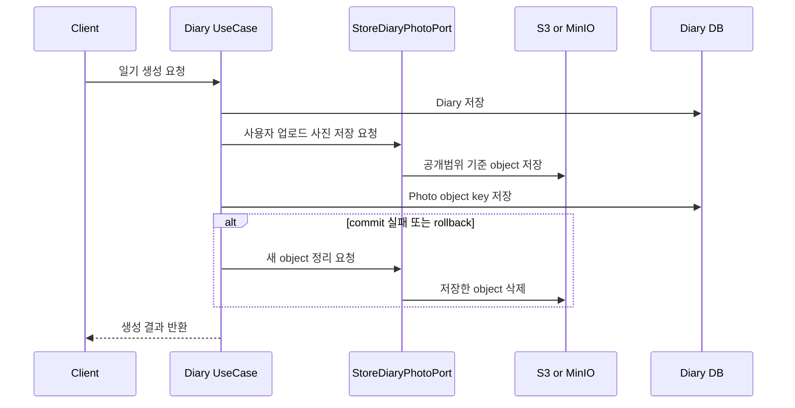
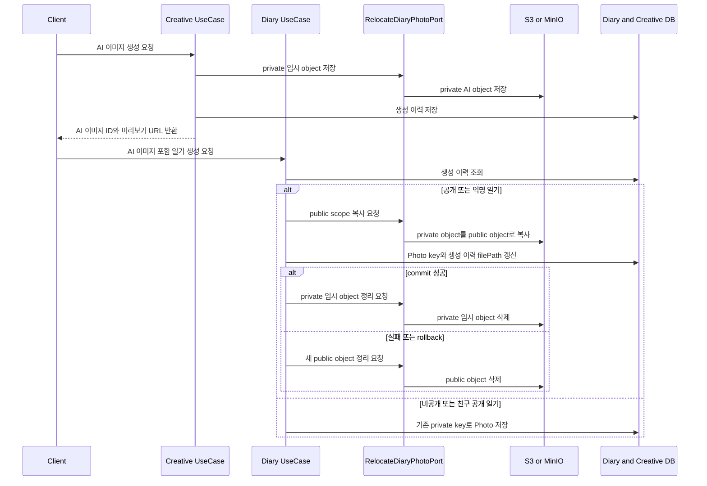
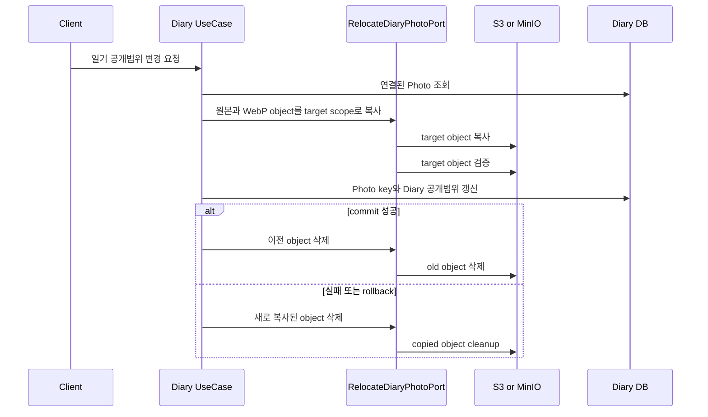
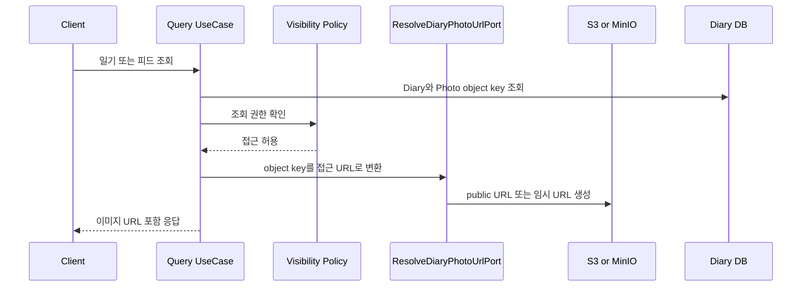

# Diary Image Storage Runbook

- Status: Active
- Audience: Engineers, Operators
- Source of Truth: Yes
- Last Reviewed: 2026-08-12

## 목적

일기 이미지의 저장 경로, 공개범위 변경 방식, legacy 호환, 조회 URL 발급, 캐시 정책을 운영자가 빠르게 확인하기 위한 문서다.

## 요약

bucket 이름은 DB object key에 포함하지 않는다. `photos.url`, `photos.optimizedUrl`, `diary_image_generation.filePath`에는 bucket 내부 object key만 저장한다.

private object의 URL은 공개 URL이 아니다. Diary 공개범위, 소유자, 친구 관계 검증이 끝난 조회 흐름에서만 임시 URL을 발급한다. URL 변환은 인가 수단이 아니다.

legacy object key에는 사용자 식별자가 포함될 수 있다. 로그, 이슈, 외부 공유 문서에서는 개인정보성 경로 데이터로 취급한다.

## 소유권

- Creative는 이미지 생성 과정, 생성 이력과 Diary에 연결되기 전 private 임시 AI object를 소유한다.
- Diary는 일기에 연결된 Photo 메타데이터, 표시 object key, 대표 순서와 공개 범위 전환을 소유한다.
- object storage SDK 호출은 Out Port를 구현하는 Storage Adapter의 책임이다. Diary Application은 bucket, endpoint, presigned URL, 파일 확장자 판별 유틸리티와 트랜잭션 동기화 API를 직접 사용하지 않는다.
- DB에는 object key만 저장한다. 접근 URL은 Diary 공개 범위 검증이 끝난 입력 또는 출력 Adapter에서 해석한다.
- 다른 Context가 아직 사용하는 legacy 저장 Port는 `SharedImageStorageCompatibilityAdapter`가 연결한다. `MinioPhotoStorageAdapter` 자체는 Diary가 소유한 Port만 구현하며, legacy 소비자가 중립 저장 Adapter로 이동하면 호환 Adapter를 제거한다.

## 현재 경로

| 대상 | 현재 경로 |
| --- | --- |
| 공개 또는 익명 일기의 사용자 업로드 사진 | `public/diary-images/user/{prefix1}/{prefix2}/{uuid}.{ext}` |
| 비공개 또는 친구 공개 일기의 사용자 업로드 사진 | `private/diary-images/user/{prefix1}/{prefix2}/{uuid}.{ext}` |
| 일기에 아직 연결되지 않은 신규 AI 임시 이미지 | `private/diary-images/ai/{prefix1}/{prefix2}/{uuid}.{ext}` |
| WebP 최적화 이미지 | 원본 object key와 같은 scope, 같은 base path, WebP 확장자 |
| legacy 사용자 업로드 사진 | 기존 key 유지. 공개범위 변경 시 canonical 경로로 옮겨질 수 있음 |
| legacy AI 이미지 | 기존 key 유지. 공개 일기 연결 시 기존 구조 그대로 public scope로 이동할 수 있음 |

## 변경 방식

| 상황 | 변경 방식 |
| --- | --- |
| 신규 사용자 업로드 사진 저장 | 일기 공개범위 기준으로 public 또는 private scope를 결정한다. 대표 사진 여부는 저장 scope 기준이 아니다. |
| 신규 AI 이미지 생성 | 연결될 일기 공개범위가 아직 없으므로 private scope에 임시 저장한다. |
| 신규 AI 이미지를 공개 또는 익명 일기에 연결 | private AI object를 public AI object로 복사하고 DB commit 전까지 private 원본을 유지한다. commit 성공 후 private 원본을 삭제하고 rollback이면 새 public object를 삭제한다. |
| 신규 AI 이미지를 비공개 또는 친구 공개 일기에 연결 | 기존 private AI object를 유지한다. |
| canonical 일기 사진의 공개범위 변경 | `public/diary-images/{source}/...` 와 `private/diary-images/{source}/...` 사이에서 scope prefix를 바꾼 object로 복사한다. |
| legacy 사용자 업로드 사진의 공개범위 변경 | target scope의 canonical 일기 이미지 key로 새로 복사할 수 있다. 이때 legacy 경로의 사용자 식별자는 새 경로에서 제거된다. |
| 복사 중 일부 object 실패 | 같은 전환에서 이미 복사한 새 object를 삭제하고 DB 참조는 변경하지 않는다. |
| 복사 성공 후 DB 갱신 또는 commit 실패 | 새로 복사된 object를 rollback cleanup 대상으로 삭제하고 이전 object 참조를 유지한다. |
| DB commit 성공 후 이전 object 삭제 실패 | 사용자-facing 결과와 새 참조는 유지하고, 실패 로그를 후속 운영 정리 대상으로 본다. |

## 사진 없는 일기 생성 흐름

사진 정보와 업로드 파일이 모두 없으면 Diary는 일기 본문과 메타데이터만 저장한다. 이 경로에서는 `StoreDiaryPhotoPort`, `RecordDiaryPhotoPort`, `RelocateDiaryPhotoPort`, `ManageGeneratedImageForDiaryPort`를 호출하지 않는다. 이미지가 없더라도 일기 저장 이후의 알림과 본문 분석 흐름은 기존 정책대로 수행한다.

## 사용자 업로드 이미지 저장 흐름

## AI 이미지 연결 흐름

## 공개범위 변경 흐름

공개 범위 전환은 `원본과 최적화 object 복사 → Photo와 Diary 참조 변경 → DB commit → 이전 object 삭제` 순서를 따른다. 최적화 object가 원본과 같은 key를 가리키면 한 번만 복사·정리한다.

## 조회 흐름

## 운영 체크

| 확인 대상 | 기준 |
| --- | --- |
| DB 값 | object key다. 클라이언트 URL과 혼동하지 않는다. |
| public/private 판별 | object key의 scope prefix가 기준이다. |
| private URL 발급 | 조회 권한 검증 이후에만 허용한다. |
| Cache-Control | `public/`은 public cache, `private/`은 no-store다. |
| WebP object | 원본과 같은 scope에 있어야 한다. |
| legacy key | 읽기 호환 대상이지만 사용자 식별자 노출 가능성이 있다. |
| 이전 object 삭제 실패 | 공개범위 변경 결과와 별개로 후속 정리한다. |
| HeadObject 403 | 객체 없음, 권한, 프록시, CDN 경로 문제를 구분한다. |

## 보안 주의

- private object key를 URL로 바꾸기 전에 Diary 공개범위 정책, 소유자 검증, 친구 관계 검증이 먼저 끝나야 한다.
- private 임시 URL이 발급됐다는 사실은 접근 권한이 있었다는 증거가 아니다.
- legacy public object key는 사용자 식별자를 포함할 수 있으므로 익명 일기 또는 비공개 전환과 관련된 경우 보안 부채로 추적한다.
- legacy object key와 파일명은 필요한 범위에서만 공유한다. 전체 key가 필요하지 않으면 파일명, 일부 prefix, 내부 추적 ID 등으로 축약한다.
- scope prefix 규칙을 바꾸면 저장, 조회, Cache-Control, WebP 최적화, 공개범위 변경 로직을 함께 검토한다.

## 관련 문서

- Photo WebP Optimization Runbook: 일기 사진 WebP 최적화 스케줄러와 상태 전이 운영 절차
- MinIO Cloudflare HeadObject Incident: MinIO HeadObject 403 장애 원인과 서버 S3 API endpoint 분리 배경
- Diary Domain Model: Photo 엔티티의 object key, optimizedUrl, 표시 URL 선택 규칙
